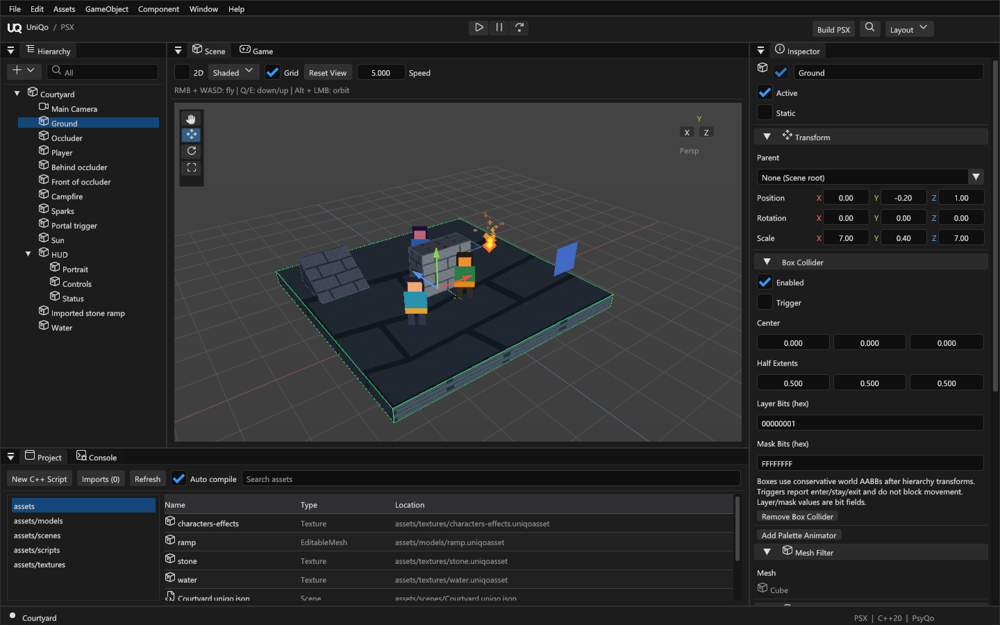
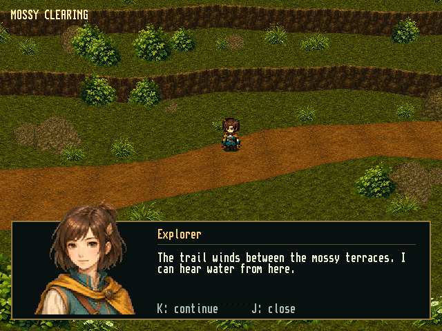
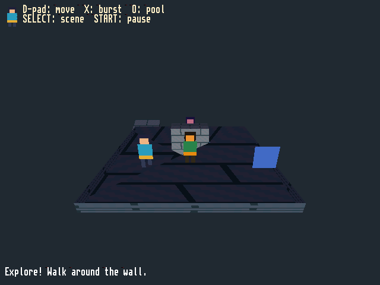
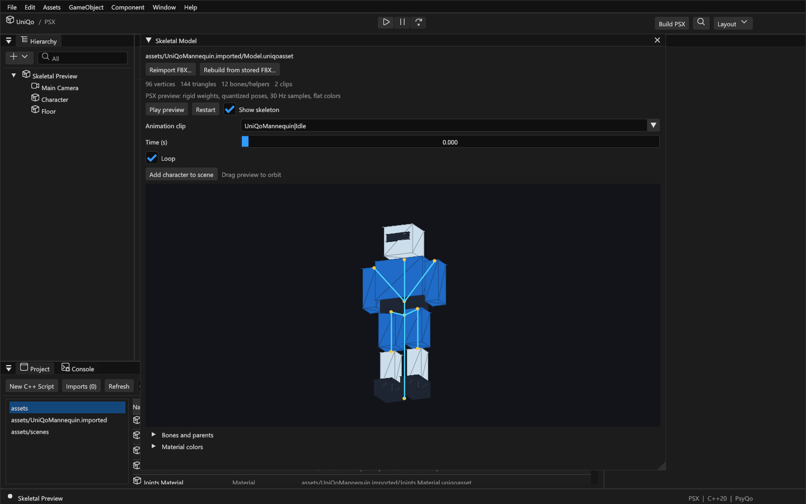
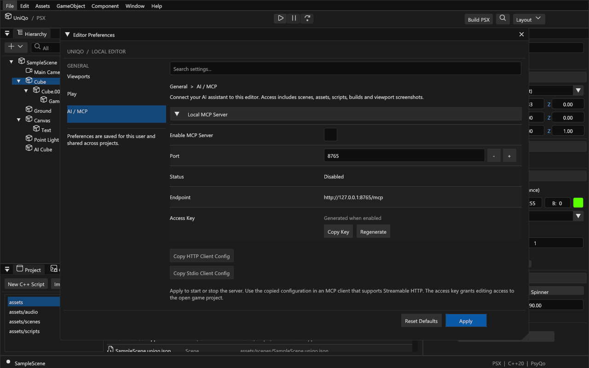

<p align="center">
  
</p>

<h1 align="center">UniQo</h1>

<p align="center">
  <strong>A desktop game engine for the original PlayStation.</strong><br />
  Build worlds, animate characters and write native gameplay.
</p>

<p align="center">
  Rust + Dear ImGui &nbsp;·&nbsp; C++20 + PsyQo &nbsp;·&nbsp; PS-X EXE + BIN/CUE
</p>

<p align="center">
  <a href="#getting-started">Get started</a> &nbsp;·&nbsp;
  <a href="#features">Features</a> &nbsp;·&nbsp;
  <a href="#examples">Examples</a> &nbsp;·&nbsp;
  <a href="#ai-assisted-development">AI assistants</a> &nbsp;·&nbsp;
  <a href="#documentation">Documentation</a>
</p>

---

UniQo brings a visual editor workflow to PSX development. Create a project, arrange a scene, import assets, write C++ behaviours and press **Play**. Your game compiles to a native MIPS executable and runs inside an integrated PCSX-Redux Game view.

**Windows x64 and macOS Apple Silicon · Experimental · MIT-licensed original code.** The editor and runtime are in active development. Emulator validation is available; physical-console validation is pending.



<p align="center"><sub>The included 2.5D courtyard, open in the real editor. Screenshots in this README show the working application.</sub></p>

## Features

| | What you can do |
| --- | --- |
| **Build your world** | Arrange entities in a dockable editor with transform gizmos, parenting and a component Inspector. Create and edit geometry with [Blockout](docs/blockout.md), including extrusion, bevels and geometry Undo/Redo. |
| **Bring in your assets** | Import [PNG textures](docs/textures.md), [OBJ/MTL models](docs/static-mesh-import.md) and [FBX characters](docs/skeletal.md). Asset identities survive moves and reimports. |
| **Animate and add effects** | Use rigid skeletal animation, atlas sprites, billboards, flipbooks and bounded [particle emitters](docs/sprites-particles.md). Add [fog, scrolling water](docs/environment-effects.md) and [palette cycling](docs/palette-animation.md). |
| **Write native gameplay** | Author C++20 behaviours with Inspector properties. Connect [input and collision](docs/input-collision.md), [scene transitions and object lifecycle](docs/runtime-services.md), cameras, tweens and [Memory Card storage](docs/memory-card.md). |
| **Light and render** | Combine baked vertex lighting, bounded realtime GTE lighting, static shadows and blob shadows. Author for PSX rendering limits with native [performance counters](docs/performance.md). |
| **Add audio and UI** | Import WAV, MP3, FLAC or OGG for SPU sound effects and XA music. Build [HUDs](docs/hud.md) with text, atlases, nine-slice images, progress bars and navigation. |
| **Play and export** | Run, pause and step games in PCSX-Redux. Build PS-X executables and BIN/CUE disc images, or [export a standalone PsyQo project](runtime/README.md). |

Projects live independently of the editor. Scenes, scripts and imported assets stay in your game folder; the engine owns the runtime and development tools.

## Getting started

### Prerequisites

- **Windows x64** or **macOS 11+ on Apple Silicon**
- [Git](https://git-scm.com/) and [Rust through rustup](https://rustup.rs/)
- On Windows: Visual Studio Build Tools with **Desktop development with C++** and a **Windows SDK**
- On macOS: Xcode Command Line Tools and [Homebrew](https://brew.sh/)

Clone into a path without spaces, then run setup:

```powershell
git clone https://github.com/franadoriv/UniQo.git
cd UniQo
powershell -ExecutionPolicy Bypass -File tools/setup.ps1
cargo run --locked
```

Setup initializes the pinned Nugget SDK and installs verified portable MIPS tools, PCSX-Redux, psxavenc and mkpsxiso under `.tools/`. Rustup selects the repository's pinned toolchain. Setup does not change your global PATH.

On macOS, download the macOS Arm build of PCSX-Redux and move it to `/Applications/PCSX-Redux.app`, then run:

```sh
xcode-select --install
./tools/setup-macos.sh
make run
```

The setup script installs Rust and the upstream MIPS toolchain with Homebrew, builds pinned host audio/disc utilities under `.tools/macos/`, and writes an untracked `uniqo.local.json`. Start UniQo with `make run` or `./tools/run-macos.sh`; neither command requires changing your shell PATH. The first launch of PCSX-Redux may require approving the unsigned application in macOS Privacy & Security.

### Your first game

1. Create a **Sample game** project in the Hub.
2. Select **Cube** and edit its **Spinner** component.
3. Press **Play** to compile and run the game.
4. Use **Pause**, **Step** and **Stop** to inspect it. Save scene changes with **Ctrl+S**.

For level building, choose the **Third Person** template and edit its platforms and ramps with Blockout. The template provides an editable arena; game behaviours define character movement and camera following.

See [Getting started](docs/getting-started.md) for configuration and troubleshooting.

<details>
<summary><strong>Common development commands</strong></summary>

| Command | Purpose |
| --- | --- |
| `cargo run --locked` | Open the project Hub |
| `cargo run --locked -- --project examples/rpg-2-5d-demo` | Open the included 2.5D project |
| `cargo build --locked --release` | Build the optimized editor |
| `cargo test --locked` | Run the default Rust test suite |
| `.\.tools\mips\bin\make.exe check` | Run formatting, tests, Clippy and the debug build |

A release build produces the editor executable; distributable application packaging is not yet provided. See [all development commands](docs/getting-started.md#common-development-commands) and [local testing](docs/testing.md).

</details>

## Examples

### Sprites, textured environments and portrait UI



<p align="center"><sub>Native 640 × 480 output captured in PCSX-Redux. A visual showcase of world sprites, textured geometry and HUD rendering. Character and environment artwork was created with AI image generation and prepared for PSX textures.</sub></p>

See [Sprites and particles](docs/sprites-particles.md), [Textures](docs/textures.md) and [HUD](docs/hud.md) for the engine features used in this scene.

### A playable 2.5D scene

The [included demo](examples/rpg-2-5d-demo/README.md) combines a courtyard and night scene with textured geometry, lit animated sprites, collision, particles, a portal, HUD text, scrolling water and shared resources.



Move with the D-pad, trigger effects and switch scenes. The demo README documents its controls. Engine APIs are documented under [Input and collision](docs/input-collision.md), [Sprites and particles](docs/sprites-particles.md), [HUD](docs/hud.md) and [Runtime services](docs/runtime-services.md).

### From FBX to an animated character

Import a mesh with its armature and clips, inspect the skeleton, preview animation and add the character to your scene. Reimport preserves asset identities and edited material colors.

Try **Assets → Import sample character (FBX)…**, select the imported **ModelSource**, then choose **Add character to scene**.

<details>
<summary><strong>See the skeletal animation workflow</strong></summary>



The included mannequin has 96 vertices, 144 triangles and Idle/Walk clips. The PSX skeletal profile uses one bone per vertex, quantized 30 Hz animation samples and flat material colors. See [Skeletal characters](docs/skeletal.md) for the workflow and limits.

</details>

## AI-assisted development

Connect an MCP-compatible assistant to work directly with the running editor. UniQo exposes **20 tools** for scenes, assets, scripts, screenshots, builds and emulator controls.

An assistant can arrange entities, move the Scene camera, capture Scene/Game/HUD/editor views, inspect build logs and control Play, Pause and Step. Scene batches support Undo/Redo and revision checks; file replacements retain local backups.

> “Inspect this scene, add a blue cube beside the platform, frame it and show me a screenshot. Then build the game and check the logs.”

Enable **Edit → Editor Preferences → AI / MCP → Enable MCP Server → Apply**, then copy the HTTP or stdio client configuration. MCP is **off by default**, uses a local access key and listens only on your computer. UniQo does not require an AI account or a specific provider.

<details>
<summary><strong>View the connection settings</strong></summary>



</details>

See the [MCP guide](docs/mcp.md) for setup, the full tool list and current limits.

## Documentation

| Area | Guides |
| --- | --- |
| **Start and configure** | [Getting started](docs/getting-started.md) · [Projects](docs/projects.md) · [Settings](docs/settings.md) · [Editor](docs/editor.md) |
| **Create content** | [Blockout](docs/blockout.md) · [Third Person arena](docs/third-person.md) · [Static model import](docs/static-mesh-import.md) · [Skeletal characters](docs/skeletal.md) |
| **Render and animate** | [Textures](docs/textures.md) · [Lighting](docs/lighting.md) · [Sprites and particles](docs/sprites-particles.md) · [Environment effects](docs/environment-effects.md) · [Palette animation](docs/palette-animation.md) |
| **Build gameplay** | [C++ scripting](docs/scripting.md) · [Input and collision](docs/input-collision.md) · [Runtime services](docs/runtime-services.md) · [Cameras and resources](docs/camera-resources.md) · [Memory Card](docs/memory-card.md) |
| **Sound and interface** | [Assets and audio](docs/assets.md) · [HUD](docs/hud.md) |
| **Extend and verify** | [AI / MCP](docs/mcp.md) · [Architecture](docs/architecture.md) · [Performance](docs/performance.md) · [Testing](docs/testing.md) · [Runtime and export](runtime/README.md) |

## Current limits

UniQo targets the original hardware's constraints. Keep these boundaries in mind when planning a project:

- **Animation:** rigid skeletal deformation is supported; skeletal textures, blended skin weights and animation blending remain future work.
- **Editing:** Blockout geometry and MCP scene batches have Undo/Redo. General editor Undo/Redo and entity multiselection remain future work.
- **Rendering:** frustum clipping and ordering tables are used; intersecting polygons can still produce sorting artifacts. Capacity limits are not frame-rate guarantees.
- **Simulation:** measured time drives fixed 60 Hz steps with bounded catch-up. Collision uses conservative AABBs, rather than rigid-body physics.
- **Resources:** prelinked scene banks share resources and reuse active objects and VRAM. Resident data must fit PSX RAM; arbitrary map streaming from CD is not implemented.
- **Validation:** builds and emulator execution are verified. Physical controllers, console performance and persistence on real Memory Cards still need hardware validation.

See [Textures](docs/textures.md), [Sprites and particles](docs/sprites-particles.md), [HUD](docs/hud.md), [Runtime services](docs/runtime-services.md) and [Resource counters](docs/camera-resources.md) for feature budgets and limits.

## Contributing

See [Contributing](CONTRIBUTING.md) for setup, local checks and change guidelines. Validation runs locally; GitHub Actions is not configured.

## License and credits

UniQo's original code and included mannequin are [MIT licensed](LICENSE). Fonts, SDKs and other dependencies retain their own licenses; see [third-party notices](THIRD_PARTY_NOTICES.md) and [runtime notices](runtime/THIRD_PARTY_NOTICES.md).

Built with Rust, Dear ImGui, PsyQo and PCSX-Redux. Proprietary PlayStation BIOS images are not bundled.
