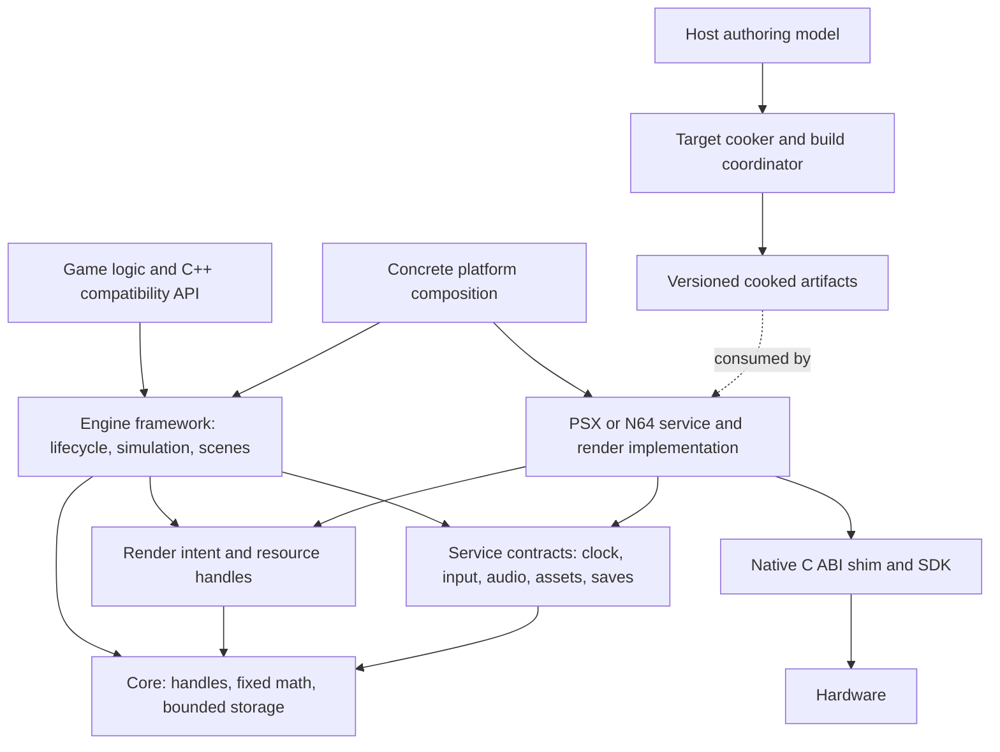

# Epok Multi-Console Architecture Plan

Navigate: [assessment](#2-current-epok-architecture-assessment) · [coupling register](#3-psx-specific-coupling-found) · [design](#6-proposed-layered-architecture) · [workspace](#7-proposed-rust-workspace--crate-layout) · [N64 roadmap](#18-n64-integration-roadmap) · [decisions](#21-architecture-decision-records) · [implementation tasks](#22-concrete-implementation-tasks-for-maintainers) · [sources](#evidence-and-source-register).

## 1. Executive Summary

Epok should evolve through a preserved PSX implementation, explicit target cooking and build boundaries, and a progressively shared Rust runtime. The right abstraction is **game and rendering intent above backend-owned command generation and memory**, with small statically dispatched service contracts. PSX ordering tables, N64 RSP/RDP work, SDK startup, DMA, interrupt handling, and physical storage scheduling belong below that boundary.

The most important correction to the starting premise is factual: **the inspected Rust code is the desktop editor and toolchain; the deployed PSX engine and gameplay API are C++20 using PsyQo**. There is no existing Rust console core or Cargo workspace to split into platform crates. Introducing one is a language and toolchain migration, as well as an architectural change. It must be earned by ABI, memory, performance, and behavior tests rather than described as a simple module extraction.

Adopt these decisions:

1. Keep the existing PSX export and runtime operational. First isolate its host cooker/build path and its native hardware services without changing generated bytes or gameplay behavior.
2. Make authoring data independent of PSX cooked data. Retain persistent asset/entity UUIDs; use compact indices and generation handles at runtime. Produce different target payloads from shared source assets.
3. Create a small `no_std`, allocation-free Rust foundation and interface layer. Prove Rust/native interoperability on **both** PSX and N64 before putting mandatory gameplay state behind it.
4. Use libdragon as the N64 SDK candidate. Establish a native boot baseline first; independently resolve Rust ABI compatibility. Upstream libdragon and the inspected `libdragon-rs` fork use different ABIs, so mixing their artifacts is not an acceptable shortcut.
5. Render bounded mesh/sprite/UI instances with cameras, transforms, material identities, and explicit ordering requirements. Let PSX and N64 cook and execute those inputs differently. Do not expose a universal GPU command buffer, descriptor set, or ordering table.
6. Assign a single owner to every stateful service and in-flight buffer. Neither a timeout nor a scene change proves hardware has released a buffer.
7. Preserve C++ gameplay compatibility during migration. Port isolated deterministic kernels first; move scene ownership only after the replacement can preserve lifecycle and component semantics without maintaining two worlds.

The first N64 milestone is a reproducible bootable ROM. The first shared-engine milestone is an input-driven, asset-backed 2D scene using the Rust framework and native N64 services. A 3D parity fixture follows. Whole-game parity, including existing C++ scripts, scene transitions, effects, audio, and saves, is a separate deliverable with an explicit compatibility inventory.

This plan is based on the working tree under `D:/GitProjects/GameEngines/Epok/EpokEngine`, whose HEAD at inspection was `81db09a5d10625eb8fae50309709d3dca3a327e6` on `develop`, on 2026-09-12. There were existing tracked modifications and an untracked `src/scene_loading.rs`; those working-tree contents are part of the assessment, not an immutable released version. Adjacent `EpokDemos` supplies representative projects; `EpokStartupQA` is a separate checkout and is not the architecture baseline. The website is outside the engine scope. Only this plan is being added; no runtime or tool refactor accompanies it. Line references below describe the inspected snapshot and must be rechecked before implementation.

## 2. Current Epok Architecture Assessment

### 2.1 Repository and dependency shape

| Area | Observed implementation | Architectural significance |
|---|---|---|
| Rust package | Root `epok-editor`, edition 2024, main binary plus `epok-header-tool`; no workspace, console crate, or package feature table | Most `crate::` relationships are unrestricted within one host package. A platform crate proposal is new structure, not existing structure renamed. |
| Host UI | `src/platform.rs`, `editor.rs`, `scene_gpu.rs`, `scene_gpu.wgsl`, `viewport.rs`; winit/wgpu/imgui | `platform.rs` is desktop window/render integration, not a console platform contract. The authoring viewport is not the PSX renderer. |
| Documents and projects | `workspace.rs`, `document.rs`, `project.rs`, `scene.rs`, `assets.rs` | Useful persistent identities, document compatibility and project ownership already exist. Keep them host-side. |
| Cooking/export | `texture.rs`, `mesh_compile.rs`, `skeletal_compile.rs`, `audio_import.rs`, `streaming.rs`, `scene_bank.rs`, `export.rs`, `playback_staging.rs` | Rust generates PSX-native data and C++ declarations; source interpretation and target lowering often share a module. |
| Build orchestration | `pipeline.rs`, `build_inputs.rs`, `staging_files.rs`, `artifact_dependencies.rs`, setup scripts | Contains dependency fingerprints, staging and native-build handling worth preserving. The architecture is more mature here than a fresh build wrapper would suggest. |
| Target runtime | `runtime/main.cpp`, `epok.hpp` and subsystem headers | C++ application/scene loop, generated scene tables, native scripts, fixed pools and GPU packets. |
| SDK | Pinned `third_party/nugget` / PsyQo | CPU/GTE/GPU, startup, CD, input, memory-card and low-level support. Do not replace it to satisfy a naming convention. |
| Host native code | `native/effect_preview.cpp/.h`, `particle_effect_preview.rs`, root `build.rs` | The editor reuses selected C++ timeline/effect/particle behavior through FFI. This is useful semantic reuse, but creates an unconditional host build dependency on PsyQo headers. |
| Tests and diagnostics | Rust unit tests, `tests/runtime` C++ fixtures, `tests/integration` Python, PCSX-Redux Lua bridge, profiler/comparison tools | Strong starting material for migration gates; test source presence is not proof that a test currently passes. |

Evidence: [Cargo manifest](D:/GitProjects/GameEngines/Epok/EpokEngine/Cargo.toml:1), [host module composition](D:/GitProjects/GameEngines/Epok/EpokEngine/src/main.rs:1), [native host build](D:/GitProjects/GameEngines/Epok/EpokEngine/build.rs:1), [runtime build](D:/GitProjects/GameEngines/Epok/EpokEngine/runtime/Makefile:1).

The inspected host manifest pins Rust 1.97.1 separately in `rust-toolchain.toml`; `tools/dependencies.json` records Nugget revision `6186b131aacc5853a9161fb076ed34ffe504552d`, GCC MIPS 16.2.0, PCSX-Redux `25270.20260904.6.x64`, psxavenc 0.3.1, and mkpsxiso 2.30. These are repository configuration facts, not an assertion that the archives were freshly installed or validated in this study. A future N64 configuration must provide equally explicit provenance.

### 2.2 Runtime and game behavior

The generated runtime includes scene/entity tables, meshes, textures, audio banks, component/script bindings and optional effect/blueprint/timeline data. `Game`/`GameScene` in `runtime/main.cpp` combine PsyQo initialization, frame service polling, simulation, world/collision synchronization, scene changes, packet generation, and presentation. `runtime/epok.hpp` exposes `psyqo::FixedPoint<12>` directly as `epok::Fixed`, along with component structs and behavior APIs.

This is a bounded scene/component engine, not a general ECS. Entity storage does not move; handles contain slot and generation; authored slots and extra dynamic slots have distinct reuse rules. Lifecycle callbacks, audio cancellation, blueprint quarantine and scene teardown are interdependent. A migration must preserve those semantics before changing storage. Introducing an archetype ECS is neither necessary for N64 nor justified by evidence of a current bottleneck.

Time is already more disciplined than a frame-count loop: `Time::advance` consumes elapsed microseconds, uses a 60 Hz fixed simulation, caps catch-up at eight ticks, handles unsigned timestamp wrap, and distributes Q12 delta as 68/69 raw units. Preserve these exact behaviors as the legacy simulation profile. Video refresh, rendering frequency, and simulation rate must become independent concepts. Evidence: [time implementation](D:/GitProjects/GameEngines/Epok/EpokEngine/runtime/time.hpp:5), [lifecycle ownership](D:/GitProjects/GameEngines/Epok/EpokEngine/runtime/lifecycle.hpp:5).

### 2.3 Subsystem assessment

| Subsystem | Existing behavior and strengths | Boundary to introduce |
|---|---|---|
| Rendering | CPU/GTE geometry, clipping, Gouraud/textured triangles, ordering tables, retained packets, conservative visibility, sprites/particles/HUD, bounded drop counters | Separate scene render extraction from PSX projection, packing, VRAM and submission. Preserve retained-packet invalidation. |
| Resources | UUID authoring references; generated scene banks; resident textures/audio/metadata; optional streamed geometry | Separate asset identity/dependencies from target payload and physical media placement. |
| Storage | Executable, CD and host-backed play options; 64 KiB geometry pages; ISO9660 and shared music/CD ownership | An asset source with bounded requests; backend-owned media arbitration; separate save service. |
| Input | Two-port held/pressed/released state; AdvancedPad shares controller bus with card support | Stable action/control snapshot with backend device mapping. Keep native button extensions. |
| Audio | Resident mono SPU ADPCM SFX; 24 voice management; one XA music stream; priority and cancellation | Logical voices and streams, target cooking, device-specific mixing/streaming. |
| Memory | Static arrays and pools, linked resource accounting, retained and streaming budgets | Explicit region ownership, phase allocation policy, in-flight lifetime and measured peak accounting. |
| Gameplay | C++ components/behaviors, hierarchy, queries, animation, timelines, blueprints, scene transitions | Portable contracts and versioned compatibility adapter, preserving behavior order. |
| Diagnostics | Scanline/CPU counters, resource counters, GTE comparison, emulator symbols and Lua tooling | Units and schema version in each diagnostic stream; transport adapters per platform. |

### 2.4 Features, unsafe code and FFI

The Rust package does not currently expose a console-selection feature model; most conditional compilation concerns host OS, tests or debug behavior. Native compile macros such as `EPOK_BLUEPRINTS`, `EPOK_VALIDATE_GTE`, `EPOK_PROFILE_DETAIL` and streaming/test choices express separate build concerns. Do not turn each existing macro into a global Cargo feature without identifying its owner and effect on artifact identity.

Rust unsafe use includes host OS calls, imgui raw buffers and the C++ preview boundary; it is not an existing Rust hardware abstraction. The preview has `repr(C)` records, size checks and RAII destruction, which are useful patterns. Size checks alone do not prove field offsets, alignment, calling convention or callback safety on another architecture. MMIO, scratchpad access, pointer casts and asynchronous ownership also exist in the C++ runtime/SDK. Audit both languages; counting Rust `unsafe` tokens alone understates target risk. Evidence: [preview ABI](D:/GitProjects/GameEngines/Epok/EpokEngine/src/particle_effect_preview.rs:124), [preview size checks](D:/GitProjects/GameEngines/Epok/EpokEngine/src/particle_effect_preview.rs:316), [native OS boundary](D:/GitProjects/GameEngines/Epok/EpokEngine/src/native.rs:8).

## 3. PSX-Specific Coupling Found

`Required` means before using the affected path on N64, not before an independent native N64 boot experiment. These findings identify architectural coupling; they are not all current PSX defects.

| ID | Issue and inspected location | Why it matters for N64 | Action / urgency |
|---|---|---|---|
| C01 | One host package owns editor, schemas, cooking, build and launch (`Cargo.toml:1`, `src/main.rs:1`) | Headless N64 tools inherit graphics/editor/PSX native dependencies | Required: extract host boundaries incrementally; preserve the root editor entry point initially. |
| C02 | `src/platform.rs:1` is desktop UI; `src/play.rs:7` uses `Target` for embedded/window/serial transport | Neither type selects a console; adding `N64` here would mix independent dimensions | Required: `PlatformId`, `RunnerId`, content selection and data mode are distinct. Rename host platform module only in an isolated mechanical change. |
| C03 | `build.rs:1` requires PsyQo fixed-point headers and compiles native preview for the root package | A headless cooker/header tool is coupled to PSX preview compilation | Required: isolate an editor-only native-preview adapter; preserve preview behavior. |
| C04 | `scene.rs:14` material uses `texture::BlendMode` and `depth_bias`; `scene.rs:205` caches `Arc<texture::Data>` | Authoring state carries PSX blend semantics and cooked texture representation | Required: source texture cache and target preview cache are separate; retain legacy PSX fields through schema migration. |
| C05 | `texture.rs:37` rejects dimensions above 256; `:55` packs BGR555/STP; `:70` limits palette; `:97` reconstructs preview from quantized color | N64 textures must not be derived from lossy PSX cooking | Required: decode source pixels once into IR, then cook PSX and N64 independently. Existing output is arrays/banks, not a TIM pipeline. |
| C06 | `settings.rs:7` mixes display dimensions, PSX retained rendering and CD page settings; `:33` lists NTSC modes | N64 VI configurations and RAM/queue costs differ; PAL is not a resolution toggle | Required: versioned per-platform settings; legacy settings default to PSX with identical behavior. |
| C07 | `runtime/epok.hpp:34` aliases PsyQo Q12; mesh/compiler/runtime code assumes its layout and math | Rust/native layout and N64 geometry must not depend on C++ SDK types | Required before shared runtime: define numeric semantics and boundary records; keep PSX Q12 implementation until differential tests pass. |
| C08 | `runtime/main.cpp:365` combines scene simulation and PSX hardware; ordering tables/packets around `:391`, timer/register access around `:404` | Porting the whole file invites PSX projection, register and storage assumptions into N64 | Required: separate frame service orchestration and render extraction from the PSX renderer; do not rewrite algorithms simultaneously. |
| C09 | `src/streaming.rs:7,117,126` defines 72-byte quads and explicit little-endian fields; `runtime/streaming.hpp:324,425,444` casts bytes and asserts layouts | N64 is big-endian and has a different representation; host struct casts are not a portable file format | Required: designate existing payload `PsxGeometryV1`; create an independent N64 payload. Shared envelope parsing is byte-based. |
| C10 | `runtime/streaming_pool.hpp:6` assumes 64 KiB pages and 2048-byte sectors; transport uses PsyQo GPU/CD state | ROM DMA has different alignment, latency and cache contracts | Required: reuse pool state machine where useful; keep physical transport and chunk sizing target-specific. |
| C11 | CD geometry reads coordinate with XA music; outstanding callbacks retain buffers (`runtime/streaming.hpp:49`, `music.hpp`) | Generic synchronous `read()` or immediate cancellation would break lifetime guarantees | Required: one PSX CD arbiter; explicit draining and completion semantics on all backends. |
| C12 | Input uses PSX button mapping and two ports (`runtime/input.hpp`) | N64 has different controls, axes, device accessories and four physical ports | Required: semantic snapshot/action mapping; platform extensions for exact native controls. |
| C13 | SFX and XA behavior share gameplay `AudioSource`; pitches/voice limits differ (`epok.hpp:43`, `audio.hpp`, `music.hpp`) | N64 sample mixing and ROM streaming are not SPU/XA equivalents | Required: validate target-supported clip roles/properties during cooking; no fake 24-channel N64 hardware model. |
| C14 | `memory.rs:7` assumes 2 MiB RAM and reports scratchpad/VRAM/SPU spaces | N64 framebuffers, audio and textures share RDRAM | Required: target region descriptors and linked/dynamic/in-flight categories; keep PSX report output compatible. |
| C15 | Generated C++ scene tables, native reflection and code emission (`export.rs`, `scene_bank.rs`, `script_backend.rs:200`) | A host authoring-provider trait is not a portable runtime script implementation | Required: target capability declaration per execution backend; reject unsupported script profiles before build. Preserve unknown authoring data. |
| C16 | Emulator debug bridge and profiler read PSX addresses/layouts (`integrations/pcsx-redux/bridge.lua`, `tools/profile_runtime.py`) | An N64 runner cannot use the same memory/register protocol | Required for N64 diagnostics: versioned common events with platform transport; preserve the PSX reader until schema migration. |
| C17 | Lifecycle uses generated globals, direct component access and callbacks (`runtime/lifecycle.hpp`, `epok.hpp`) | Straight Rust ownership migration could create stale references or duplicate authority | Recommended before broad parity: inventory direct field/pointer usage. Mandatory before scene ownership transfer. |
| C18 | Runtime heap/stack peaks are explicitly unknown (`src/memory.rs:1`); hardware validation is pending (`runtime/README.md`) | Larger N64 RAM does not prove the design fits PSX or is DMA-safe | Required before performance/parity signoff: linked maps, stack/pool high-water marks and hardware evidence. No unsupported claim of allocation-free execution today. |

## 4. PSX vs N64 Architectural Differences

Hardware facts and SDK implementation choices must be kept distinct. The following implications are design recommendations derived from the cited documentation; they are not claims that a particular Epok backend already implements them.

| Concern | PSX | N64 | Engine consequence |
|---|---|---|---|
| CPU / numbers | Little-endian MIPS I/R3000-family; no general-purpose hardware FPU; GTE provides geometry operations | Big-endian VR4300, 64-bit CPU registers and FPU; SDK ABI is a separate choice from CPU width | Fixed gameplay math can be shared; native geometry math need not be. Never infer pointer width or calling convention from the console name. |
| Main memory | 2 MiB main RAM; separate 1 MiB VRAM and 512 KiB SPU RAM; 1 KiB scratchpad | 4 MiB RDRAM base, 8 MiB with Expansion Pak; CPU and graphics/audio share main memory | Region budgets differ; N64 texture/source/framebuffer bytes are not independent pools of free hardware memory. |
| Graphics work | CPU/GTE transforms; GPU consumes screen-space packets; ordering tables arrange painter ordering | RSP executes microcode; RDP rasterizes queued commands; software stack controls command/microcode format | Share scene/draw intent, not low-level commands or geometry stages. |
| Visibility / depth | No conventional hardware depth buffer; affine texture mapping and explicit draw ordering | RDP supports depth buffering and perspective-correct texture mapping | Material/order policy must state semantic requirements and target fallbacks. Results need not be pixel-identical. |
| Texture working set | VRAM allocation, texture pages and CLUTs; indexed 4/8-bit and direct 15-bit color representations | RDP texture memory is a small 4 KiB working store, loaded from RDRAM; formats and palette/tile restrictions apply | Offline texture partitioning and batching are different problems. Neither 256 pixels nor 4 KiB is a universal source-asset limit. |
| DMA / visibility | GPU/SPU/CD transfers and packet lifetimes, PSX memory/bus rules | Cached/uncached aliases, cache-line maintenance and peripheral/signal/display/audio transfers | Backend owns preparation, submission and retirement. `volatile` is insufficient for cache coherence. |
| Audio | SPU voices and sample RAM; XA/CDDA use CD resources | The audio interface consumes sample buffers; mixing/decoding may use CPU/RSP according to SDK | Expose logical playback; reserve queue time and buffers for the chosen native mixer. |
| Input / saves | Two controller connectors, optional multitap; cards share serial interface | Four controller connectors; accessories and cartridge save hardware vary | Device count and save availability are runtime observations constrained by the build profile. |
| Bulk assets | CD sectors, seeks, media contention, optional executable residency or host dev transport | ROM/cartridge transfers, DragonFS or packaged ROM regions; flashcart extensions are optional | Separate logical asset source, packaging, physical reader and save storage. |
| Boot / execution | PS-X executable or bootable disc; PsyQo/Nugget startup and linker conventions | ROM construction and SDK boot/startup/linker conventions | One native entry/startup owner per artifact; final link and packaging stay SDK-specific. |

PSX facts should be checked against the pinned SDK and the reverse-engineering specification maintained by the console development community; its provenance is technical research rather than Sony SDK documentation. [PSX memory map](https://psx-spx.consoledev.net/memorymap/), [GPU specification](https://psx-spx.consoledev.net/graphicsprocessingunitgpu/), [GTE specification](https://psx-spx.consoledev.net/geometrytransformationenginegte/), [SPU specification](https://psx-spx.consoledev.net/soundprocessingunitspu/).[^1]

Rust's PSX target is Tier 3, with no prebuilt target libraries; its target specification selects MIPS I, little-endian 32-bit pointers, soft float, O32 and aborting panic, and currently disables atomic widths. That makes an explicit nightly/compiler-builtins and native-link proof necessary even though the target name exists. [Rust PSX target](https://doc.rust-lang.org/rustc/platform-support/mipsel-sony-psx.html), [target implementation](https://raw.githubusercontent.com/rust-lang/rust/master/compiler/rustc_target/src/spec/targets/mipsel_sony_psx.rs).[^2]

Nintendo's archived manuals describe the 4 KiB TMEM working store, RDP depth/perspective attributes, 4/8 MiB RDRAM capacities and the RCP's shared-memory role. These are hardware facts; libdragon's queue implementation is a separate SDK policy. [TMEM](https://ultra64.ca/files/documentation/online-manuals/man/pro-man/pro13/13-08.html), [RDP rasterizer](https://ultra64.ca/files/documentation/online-manuals/man/pro-man/pro12/12-03.html), [RDRAM capacity](https://jrra.zone/n64/doc/caution/caution/index12.htm), [execution overview](https://ultra64.ca/files/documentation/online-manuals/man/pro-man/pro03/03-01.html).[^18]

Further N64 references and the precise ABI comparison appear in sections 12–15. No PS2 or GameCube SDK commitment is made here. Their future backends must pass the same capability, toolchain and lifetime gates; a generic thread pool, common GPU ISA, or universal native scalar would obstruct that goal.

## 5. Architectural Design Principles

1. **Preserve working behavior before moving ownership.** Each extraction has a baseline artifact, test fixture and rollback point. A file move and an algorithm replacement are different tasks.
2. **Make low-level specialization normal.** Portable game concepts coexist with typed PSX/N64 extensions. Unsupported behavior produces a build error or an explicitly selected approximation.
3. **Pay once, offline where possible.** Resolve names, dependencies, layout, quantization, material support and capacities during cooking. Runtime performs bounded validation and indexed access.
4. **Use a small static runtime.** `no_std` is the default; normal frames do not allocate. No ambient `Arc`, `Mutex`, OS thread, filesystem path or editor model crosses into console contracts.
5. **Distinguish semantic and binary portability.** Identical gameplay timing can coexist with different draw commands, audio representations and endianness. A shared Rust struct is not a portable disk format or an automatically correct C ABI.
6. **Have one owner and an explicit retirement event.** Scene state, SDK initialization, physical media, interrupt configuration, GPU buffers, audio buffers and save operations each have one authority.
7. **Measure cost rather than assuming zero cost.** Static dispatch avoids vtables but may increase code size. Generic math can emit expensive helpers. Profile compiled artifacts and data movement.
8. **Do not ship theoretical generality.** Defer archetype ECS, runtime plugin loading, render graphs, universal job systems, network stacks and shared virtual-memory abstractions until required by a concrete product.

## 6. Proposed Layered Architecture



Arrows in the runtime part indicate permitted compile dependencies, not GPU execution order. Core and interfaces never import a concrete platform. The game executable is the composition root and chooses a platform type. The engine owns policy and state; the platform implements service mechanisms and rendering translation. Native startup may call an exported Rust run function without gaining ownership of engine state.

**Core:** IDs, fixed numeric types, deterministic clock arithmetic, generation tables, bounded collections, small errors and common resource descriptors. No scene serialization, SDK, renderer, filesystem or logging transport.

**Framework:** simulation order, entity/component lifetime, transforms, scene transitions, animation and gameplay-facing operations. Begin with the existing bounded component model. Port modules only when their data ownership and compatibility contract are testable.

**Interfaces:** render intent, asynchronous asset requests, input snapshots, clock samples, logical audio commands, saves and diagnostics. Separate traits, not a mandatory giant `Platform` service object passed through every function.

**Backend:** video configuration, packet/display-list generation, geometry acceleration, resource placement, command submission/retirement, memory regions, SDK callbacks and devices. Backend-internal scheduling chooses how CPU/coprocessor work overlaps.

**Host:** source parsing, rich editor data, validation, cooking, build orchestration, packaging and runners. Dynamic dispatch and ordinary heap use are acceptable here. Host platform selection does not imply a runtime virtual device table.

### Migration states and ownership

| State | PSX | N64 | Shared Rust responsibility |
|---|---|---|---|
| M0: baseline | Existing C++ runtime and generated data | None | Host tools only |
| M1: boundaries | Same runtime, named PSX cooker/build/service seams | Native libdragon boot/SDK probes | Foundation and contract tests on host |
| M2: interoperability | Optional Rust library linked into native startup; isolated kernels only | ABI-proven Rust library in native startup | One replacement kernel at a time; caller owns its state |
| M3: shared vertical slice | Opt-in new framework for a small parity fixture; legacy export remains available | Same small Rust framework + native renderer/services | Tick/input/2D scene state has one Rust owner |
| M4: gameplay migration | Gradually opt-in per module and project profile | Extended feature parity | Rust owns migrated subsystems; C++ adapters access that owner |

Do not run C++ and Rust schedulers together. Do not mirror mutable entities in both languages. Until an entire stateful subsystem can transfer, it remains under its old owner and the Rust replacement is exercised in an isolated test/profile. Cross-language calls are per service batch or kernel, not per vertex.

## 7. Proposed Rust Workspace / Crate Layout

Use a staged workspace with the current root `epok-editor` package retained initially. Set resolver 3 and explicit default host members. Add crates only when extracting real responsibilities. A virtual root and moving the editor to `apps/epok-editor` can wait. Cargo supports a root package plus workspace, shared lockfile and explicit default members. [Cargo workspace reference](https://doc.rust-lang.org/cargo/reference/workspaces.html).[^3]

Every crate below has an allowed dependency set; all other workspace dependencies are forbidden unless a reviewed change updates the table. Transitive SDK/editor dependencies in runtime crates are also forbidden.

| Package / location | Responsibility and public boundary | Allowed workspace dependencies | `no_std` / features / native dependency |
|---|---|---|---|
| `epok-core` / `crates/core` | `AssetId`, handles, fixed math, bounded containers, time arithmetic, base errors | None | Yes; no default features, no `alloc`. Audited unsafe only for storage primitives if needed. |
| `epok-format` / `crates/format` | Cooked envelope, manifest records, byte readers, version/target IDs; no target texture definitions | core | Yes; no default features. Host writers may use a separate host module or tool implementation. |
| `epok-render` / `crates/render` | Draw packets of intent, camera/transform records, material/mesh/texture handles, renderer trait and semantic capability types | core | Yes; no default features. No SDK, global allocator, or `wgpu`. |
| `epok-platform` / `crates/platform` | Independent clock/input/audio/assets/save/diagnostic contracts, operation states, static and probed capability descriptors | core, format | Yes; no default features. No concrete backend dependencies. Render trait stays in render. |
| `epok-engine` / `crates/engine` | World/lifecycle, fixed scheduler, scene/animation/game service logic | core, format, render, platform | Yes; optional additive `timeline`, `particles`, `blueprints` when implemented; default empty for first slice. No blanket `alloc` feature. |
| `epok-platform-psx` / `platforms/psx` | Safe PsyQo-backed services, render translator, PSX resource and DMA ownership | core, format, render, platform | Yes for Rust; native C++ shim privately owns SDK. Local `profile-detail`, `validate-gte` mirror explicit build profiles. |
| `epok-platform-n64` / `platforms/n64` | Safe libdragon-backed services, native renderer, RDRAM/cache/queue ownership | core, format, render, platform | Yes for Rust; native C/libdragon privately. A later `tiny3d` implementation is an explicit SDK/cooker profile, not a core feature. |
| `epok-platform-host` / `platforms/host` | Deterministic test services, trace renderer; later an optional playable host backend | core, format, render, platform | `std`; `windowed` optional only if implemented. Headless trace backend first. |
| `epok-authoring` / `crates/authoring` | Project/source schemas, persistent UUIDs, source asset IR, reflection IR and document migration | core only if portable IDs are reused | `std`; serde/UUID/source decoders allowed; no native SDK, editor UI or target cooker dependency. |
| `epok-cook` / `crates/cook` | Dependency graph, hashes, validation framework, `CookRequest`/`CookOutputs`, target cooker interface | authoring, core, format, render, platform | `std`; imports interface-only capability schemas, never concrete runtime backends. IR belongs in authoring. |
| `epok-cook-psx` / `tools/cook-psx` | Existing PSX quantization, headers, layouts, script lowering, scene bank and disc data preparation | authoring, cook, core, format, render, platform | `std`; external converters via explicit tool paths. Does not build/load a PSX runtime crate. |
| `epok-cook-n64` / `tools/cook-n64` | N64 textures/mesh/audio lowering, ROM asset layout, target validation | authoring, cook, core, format, render, platform | `std`; pinned native converter tools. No PSX cooker dependency. |
| `epok-build` / `crates/build` | Build plans, target recipes, fingerprints, staging, SDK checks, runner descriptors | authoring, cook, cook-psx, cook-n64, core, format | `std`; host-only static target registry. No editor dependency. N64 registration introduced after its recipe exists. |
| `epok-editor` / root initially | UI, scene preview, content editing, MCP, authoring orchestration | authoring, cook, build, core, native-preview | `std`; desktop/OS code stays here. Existing executable name remains stable. |
| `epok-native-preview` / `integrations/native-preview` | Current host C++ effect preview behind a safe Rust API | core only if needed | `std`; sole host owner of current PsyQo preview include/build dependency. Temporary but useful compatibility adapter. |
| `epok-header-tool` / `tools/header-tool` | Existing C++ reflection executable | authoring | `std`; host libclang. Copyable include facade is an explicit input; no GPU preview build. |
| `cargo-epok` / `tools/cargo-epok` | Thin CLI over build plan, cook, package and run operations | build, authoring | `std`; no new pipeline implementation; introduced only by its separately authorized implementation task. |

Game composition packages live in `examples/portable-smoke` and later generated project output. They depend on engine plus exactly one concrete platform per target artifact. They own Rust panic handlers, any approved allocator, and the ABI export called by native startup. Native `crt0`, SDK linker scripts and platform shims remain under their platform build recipe.

Do not create separate `epok-audio`, `epok-input`, `epok-memory` crates initially. Small public contracts fit in platform/core modules; split them only for a real dependency or independent compilation reason. Keep the existing `runtime/` paths stable while adding `runtime/platform/psx/` seams; move the native tree wholesale only after embedded-source staging and standalone exports have coverage.

Authoring extraction moves DTOs, serialization and pure validation first; existing mixed modules such as `scene.rs`, `timeline_scene.rs` and `hud.rs` cannot be moved wholesale without importing editor/cooking code. Use compatibility re-exports while separating those concerns. Native-preview extraction moves only ABI records, native ownership and calls; scene resolution, asset compilation, conversion and the editor `View` stay in host adapters. Cookers import the same interface-only capability enums/descriptors used by runtime startup, preventing a second capability vocabulary.

## 8. Dependency Rules

1. Runtime crates cannot reach host `std` dependencies, `serde_json`, filesystem paths, networking, UI, compiler invocation, or SDK tooling. Host tests may use `std` as dev dependencies.
2. A concrete platform implements interfaces; interfaces never select a platform. Selection happens in the game composition/build recipe. Separate PSX and N64 builds use explicit package/target selection and distinct artifact directories.
3. Runtime feature flags are additive subsystem selection. Mutually exclusive console identities are not additive workspace features. CI never assumes `--all-features --workspace` represents a valid console build.
4. The authoring model cannot depend on cooked payloads. A target preview is a tagged derived cache keyed by source and cook profile. A source document cannot acquire a backend-native pointer or GPU object.
5. Toolchain setup is explicit. `build.rs` may compile a package-local native adapter or generate deterministic bindings from configured inputs. It must not download an SDK, launch an emulator, cook the whole project, or recursively orchestrate the engine.
6. Each C ABI is owned by a small native integration module, versioned separately from disk data. Headers and Rust records use fixed-width fields and compile-time layout assertions. C++ SDK types never appear in portable public headers.
7. Enforce the graph with Cargo metadata checks, no-default-feature builds and include-boundary checks. During transition, allowlisted native legacy includes remain confined to named adapters with a removal task, rather than spread as `cfg(psx)` through generic code.

## 9. Platform Abstraction Design

### 9.1 Dispatch and composition

Use Rust traits with associated types and static dispatch for the Rust runtime. A concrete game composition instantiates one platform. Keep most engine state nongeneric; make the run loop and service-consuming operations generic over small interfaces. This limits repeated monomorphization of large gameplay systems. Native adapters use direct C symbols. Host tooling may use `dyn TargetCooker`/`dyn BuildRecipe` because it is not a console frame path.

The following is an interface sketch, not checked-in implementation or a promise of source-compatible final signatures:

```rust
pub trait Clock {
    fn sample_us_wrapping(&mut self) -> u32;
}

pub trait InputSource {
    fn sample(&mut self, out: &mut InputSnapshot) -> Result<(), InputError>;
}

pub trait AudioDevice {
    fn apply(&mut self, commands: &[AudioCommand]) -> Result<(), AudioError>;
    fn service(&mut self, out: &mut AudioEvents) -> Result<(), AudioError>;
}

pub trait AssetSource {
    // The slot is source-owned; no asynchronous borrowed destination escapes.
    fn request(&mut self, range: AssetRange) -> Result<RequestId, IoError>;
    fn poll(&mut self, id: RequestId) -> Result<RequestState, IoError>;
    fn ready_bytes(&self, id: RequestId) -> Result<&[u8], IoError>;
    fn release(&mut self, id: RequestId) -> Result<(), IoError>;
    fn cancel(&mut self, id: RequestId) -> Result<(), IoError>;
}

pub struct Services<C, I, A, S, V, D> {
    pub clock: C,
    pub input: I,
    pub audio: A,
    pub assets: S,
    pub saves: V,
    pub diagnostics: D,
}
```

`RequestId` is generation-checked. `ready_bytes` succeeds only after CPU visibility is established and holds an immutable borrow of the source; no subsequent mutable operation can recycle that slot while the returned borrow is used. `release` rejects pending/draining work. `cancel` marks cancellation but does not grant reuse. The backend completes or safely quiesces transfers before recycling internally owned storage. Advanced zero-copy geometry streaming uses a **backend-private** lease integrated with the renderer; it is not forced through an extra generic copying layer.

A useful request state machine is `Queued → InFlight → Ready | Failed`, with `InFlight → Cancelling → Cancelled` and explicit drainage before terminal cancellation. Failure due to timeout may still be draining. Diagnostic status and ownership state are separate: an error can be reported while the slot remains unavailable. A scene epoch identifies requests to abandon without invalidating memory still owned by hardware.

### 9.2 Boot, interrupts and shutdown

Native SDK startup owns entry code, exception/interrupt vectors, initial stack, native runtime constructors and low-level hardware setup. It then invokes the selected application entry. Initialize in dependency order: memory/diagnostics, clock, video/renderer, input, audio, asset source, save service, then framework and initial scene. Return a typed boot result at each step. The current `Game::prepare()` ignores `audio_initialize`'s boolean result; introduce a reported failure in a small PSX-only change before generalizing initialization.

Shutdown means bounded quiescence, not universally exiting to an OS. Stop accepting work; stop/drain audio and storage; finish graphics reads/writes; detach callbacks; release scene resources; either return on a host or halt/reset through a backend-specific action. Boot failure must not attempt cleanup of uninitialized services.

Keep interrupt handlers in native platform code initially. They acknowledge hardware and update preallocated completion state or fill already allocated audio buffers. They do not invoke arbitrary gameplay, allocate, format strings, or reenter a Rust world with an outstanding mutable borrow. A native critical-section adapter protects shared completion state where needed; do not assume atomic operations exist on PSX. SDK interrupt ownership is exclusive, including any future coprocessor job system.

Threading is optional. The base engine is single-threaded and cooperatively services asynchronous hardware. Future desktop/PS2/GameCube backends may provide explicit job executors; no `Send`, thread handle or blocking mutex is required by the core gameplay contract.

### 9.3 C ABI and C++ compatibility

Use `extern "C"`, fixed-width scalar fields, explicit pointer/length pairs, status codes and out-parameters. `repr(C)` plus a C header expresses layout intent, but the chosen compiler/ABI still needs executable tests. Avoid `bool`, `usize`, bitfields, packed unaligned structs, Rust enums/references/slices, trait objects, C++ classes and virtual methods in ABI records. Copy descriptions when cheap; use backend-owned opaque handles for asynchronous state. Rust panic and C++ exceptions must not cross the boundary. [Rust FFI guidance](https://doc.rust-lang.org/nomicon/ffi.html).[^4]

The current C++ gameplay API permits direct fields and pointers, including `Transform&` callbacks. Preserve it unchanged in the legacy runtime profile. For the new shared framework, introduce a versioned C++ facade containing handles and property accessors plus a supported portable subset. Existing generated C++/Blueprint code can initially continue in a native-owned compatibility subsystem. Before migrating a subsystem to Rust, either its users move to accessors or it has a scoped edit transaction whose owner is unambiguous and whose borrow ends before another service can reenter. Do not assert arbitrary old C++ source is automatically compatible with a Rust-owned world.

An incremental port may be a stateless Q12 function called by both runtimes, a Rust-owned scheduler with an opaque native handle, or a complete isolated pool service. It may not be two mirrored authoritative worlds. Document ownership, call direction, callback context, lifetime, ABI version and allocation domain for every boundary.

## 10. Rendering Architecture

### 10.1 Abstraction level

The public renderer consumes scene intent at **instance granularity**, not screen-space triangles or PSX packet words. A frame description contains one or more ordered passes with a camera, viewport, clip parameters and clear/presentation policy. Draws contain `MeshHandle`, `MaterialHandle`, a bounded transform/pose reference, tint and ordering data. Sprite/UI batches contain atlas/material handles, rectangles/UV regions and explicit painter order. Rendering extraction is a framework operation; backend preparation, visibility refinement, projection, lighting, tessellation and command construction are backend operations.

Avoid retaining a second maximum-sized scene copy just to render. Use caller-provided fixed-capacity draw storage or bounded batches traversing stable scene arrays. A small game may submit directly while traversing; a batching profile may collect sortable instance indices. Capacity and overflow policy are profile parameters with byte accounting.

```rust
pub trait Renderer {
    fn begin(&mut self, frame: &FrameDesc) -> Result<(), RenderError>;
    fn submit(&mut self, batch: DrawBatch<'_>) -> Result<(), RenderError>;
    fn finish(&mut self) -> Result<FrameTicket, RenderError>;
    fn completed(&mut self, ticket: FrameTicket) -> bool;
}
```

`submit` copies transient CPU descriptions into backend-owned storage or fully consumes them before returning; it never retains an untracked caller slice. Persistent mesh/texture/pose resources referenced by handles are pinned internally until their consumer completes. Resource destruction becomes deferred retirement. `finish` ends submission and returns a ticket; it does not prove execution or presentation has finished. The backend may block at a bounded frame boundary when all configured slots are busy. A failed submission is reported and leaves a documented recoverable frame state; it does not partially mutate a caller's scene.

### 10.2 Materials and order semantics

Start with small named material profiles: unlit color, vertex-lit color, opaque textured, cutout textured, and explicit transparent intent. Each material stores a required render profile and portability policy. Source data retains color/alpha intent, texture/sampler choice and light reception; cooked records contain target state. Existing Average/Add/Subtract/AddQuarter modes become `PsxLegacyBlend` extension values, preserved in migrated projects. They do not silently become generic alpha blending.

Portable transparency supports only semantics verified on the selected targets. If an exact operation is unavailable, the cooker returns `UnsupportedMaterial` with asset/entity context unless the author has selected a documented target override or approximation. Palette animation likewise requests a capability; N64's palette/TMEM use is not automatically equivalent to a persistent PSX CLUT edit.

Use explicit pass/layer/order constraints:

| Class | Shared requirement | PSX strategy | N64 strategy |
|---|---|---|---|
| Opaque world | Occlusion subject to target rendering profile | GTE/software geometry and depth buckets, retaining current ordering limitations | Depth-buffered path; material/texture grouping inside valid order constraints |
| Cutout world | Transparent texels do not cover background | PSX transparency and cooked palette semantics | Verified RDP/Tiny3D combiner/alpha/depth configuration |
| Transparent world | Ordered visibility and explicit blend profile | Existing painter order, OT bias under PSX extension | Depth test/write and sorted blending per material profile |
| Sprites | Explicit world/screen orientation and ordering | Existing OT integration, clipping and blend rules | Billboard/quad preparation or RDPQ path as appropriate |
| HUD | Stable authored painter order | Existing UI primitives after world rendering | Ordered RDPQ draws after world pass |

For the new portable profile, stable authored order is the tie-breaker. The legacy PSX profile preserves existing traversal and bucket insertion exactly: PsyQo prepends fragments, so equal-bucket execution reverses insertion order (`third_party/nugget/psyqo/ordering-table.hh:93`, `fragments.hh:93`). A new portable adapter must account for this explicitly rather than changing legacy rendering during extraction. General material sorting must not cross a transparency/UI order boundary. Generic `layer` is not a renamed OT index. Keep the old depth bias in PSX extension data until an authored migration defines its intended semantics.

### 10.3 Target implementations

**PSX:** keep current 512-bucket OTs, double-buffered primitive arrays, retained packet cache, clipping reserves, GTE range checks/software fallback and frame-clear policy inside the backend. Preserve all currently supported display modes and interlace masking. The platform renderer owns packet allocation, native addresses, texture pages/CLUTs and GPU chain completion. A future format expansion to 4-bit/direct color is optional; Epok's current native texture implementation is 8-bit indexed. PsyQo documents asynchronous chained fragments and their buffering requirements. [PsyQo concepts](https://github.com/pcsx-redux/nugget/blob/main/psyqo/CONCEPTS.md).[^5]

**N64 2D:** begin with libdragon RDPQ surfaces/rectangles/textured sprites, backend-owned framebuffers and a 320×240×16-bit demonstration profile. This establishes resource loading, input and retirement without assuming a 3D microcode ABI.

**N64 3D:** evaluate Tiny3D as the first implementation behind the same mesh intent. Pin its importer/model format, vertex packing, matrix layout, microcode and compatible libdragon revision together. Tiny3D currently requires libdragon's preview branch; do not silently replace the already proven 2D SDK profile with a floating preview checkout. A small direct draw fixture precedes custom model cooking. [Tiny3D upstream](https://github.com/HailToDodongo/tiny3d).[^6]

N64 display lists/recorded blocks are backend resources. They may contain commands that subsequently read matrices, vertices or textures from RDRAM; recording does not make those inputs disposable. RSP completion and RDP completion are different events, and framebuffer ownership may continue until scanout releases it. Keep persistent resource pins and transient frame storage until all relevant consumers retire. [Tiny3D referenced-data lifetime](https://github.com/HailToDodongo/tiny3d#matrices-and-vertices-are-dmad-in), [RSPQ reference](https://libdragon.dev/ref/rspq_8h.html).[^7]

### 10.4 Geometry and numeric contract

Preserve a `LegacyQ12` simulation profile: signed 32-bit raw values, 12 fractional bits, explicit conversion range, rounding and overflow behavior derived from PsyQo and Epok fixtures. Multiplication/division use verified intermediate widths and implement the current negative rounding behavior; no informal replacement with `f32` or Rust default overflow is accepted. A numeric task first writes test vectors for negative values, limits, rotations, division and interpolation, then chooses checked/saturating/wrapping operations per named API. Invalid authored values fail cooking; critical runtime overflow returns a diagnostic according to that API.

Compatibility covers defined, in-range operations. Existing signed overflow or `INT_MIN` negation in C++ is not a valid reference result. Do not turn compiler-dependent undefined behavior into golden tests. Invalid division, negation and overflow must be rejected or assigned explicitly versioned checked behavior; the decision and its compatibility impact precede the Rust replacement.

N64 may convert transforms once per visible instance into its native floating-point/16.16 matrix representation and use RSP-native packed vertices. Mesh quantization is per target. Shared source geometry keeps normals, topology, UVs, materials, bounds and skeleton relationships before target quantization. PSX spatial chunk subdivision and N64 vertex/microcode batching are distinct cook passes. Use resource handles to avoid moving large mesh data across FFI.

Do not genericize every math type over a scalar parameter: this complicates semantics and duplicates code. Keep deterministic gameplay numeric types explicit; backend math is private. A future float gameplay profile needs a new determinism and compatibility decision, not a hardware-capability toggle.

## 11. Asset Pipeline Architecture

### 11.1 Preserve existing source identity and provenance

Current `.epokasset` packages contain authoritative metadata/source snapshots; asset indexes and conversions are rebuildable. Preserve UUIDs, checksums, explicit dependency edges, expected-revision writes, generated file ownership and build-input recertification. Extend `artifact_dependencies`, `scene_dependencies`, `playback_staging`, `staging_files` and `build_inputs`; do not introduce an independent competing asset registry.

The pipeline becomes:

```text
Source package + import settings + authoring document
  → source decode / validated host IR
  → selected target validation and cooking
  → versioned payloads + target manifest + generated gameplay bindings
  → native/Rust build + linked memory report
  → disc / ROM / executable packaging
  → certified artifact + optional selected runner
```

A `CookRequest` contains source IDs and content hashes, dependency closure, engine/cooker versions, platform/profile ID, target payload ABI, settings, supported runtime feature set, and tool fingerprints. `CookOutputs` contains relative artifact paths, hashes, sizes, alignment/residency requirements, dependency edges and structured diagnostics. Cooking consumes a stable source snapshot; certification fails if relevant inputs change before publish. Changes to SDK-dependent packing or native layouts invalidate both cook and build results.

### 11.2 IR and target data

| Asset | Shared source / host IR | PSX output | N64 output |
|---|---|---|---|
| Texture | Original pixels, dimensions, color/alpha interpretation, import intent | Current 8-bit indexed pixel/palette arrays and VRAM bank descriptors; optional future TIM importer only if useful | Target-selected format, palette/tile layout, mip/LOD policy if supported; TMEM feasibility checked against material use |
| Mesh | Topology, source positions/normals/UVs, materials, bounds, skin data | Existing Q12 spatial chunks, UV/material records, baked colors, retained-packet metadata | Native vertex batches/model format, bounds and target quantization; optional recorded blocks with explicit relocations/lifetimes |
| Animation | Bones, clips, sampled or curve IR, events | Current quantized clips and one-bone-per-vertex profile | Independently cooked matrices/weights/animation profile supported by chosen renderer |
| Audio | Decoded PCM, loop markers, channel layout, intended SFX/music role | SPU ADPCM bank or XA track | Chosen libdragon-compatible sample/stream encoding and working-buffer plan |
| Scene | Persistent entity IDs, hierarchy, component values, resource dependencies | Existing C++ bank tables preserved initially | New runtime scene records or generated target declarations with compact indices |
| Script/Blueprint | Versioned reflected declarations and existing source/codegen representation | Existing C++ output and bindings | C++ subset through target facade initially, or newly implemented Rust game code; unsupported nodes fail validation |
| Timeline/VFX | Stable IDs, typed tracks/events and bounded budgets | Existing generated immutable tables | Compatible semantic tables with native-endian decoding or target emission; Rust kernels only after parity |

Current `blueprint_ir::Expression.cpp` is C++ text, not a language-neutral expression tree. Do not promise Rust code generation from it without a distinct compiler project. N64 can support generated C++ against a portable facade while Rust owns other framework services. Exact node/function support is part of the cook profile.

### 11.3 Manifest and runtime layout

Use two related manifests: a rich host build/provenance manifest and a compact runtime resource directory. The runtime must not parse authoring JSON or source filenames during a frame.

Define the new binary envelope explicitly, with little-endian byte fields regardless of host/target: magic, schema version, target ID, payload kind/version, payload-endian tag, header/table lengths, asset count, total payload length, build-manifest digest and checksum. Validate lengths with checked arithmetic before creating any views. Do not serialize native pointers, `usize`, padding, compiler enum layouts or OS paths. A target payload may be native-endian and aligned after the byte-decoded envelope. Existing PSX page bytes remain unchanged under the named legacy payload format; adding the envelope is a separately versioned loader task.

Directory records include compact `AssetIndex(u32)`, kind, payload offset/length, uncompressed size, alignment, dependency slice and residency class. Resolve authoring UUIDs to deterministic build-local indices during cooking and retain a debug sidecar mapping back to UUID/path. Do not store build-local indices in game saves; saves use persistent game-domain identifiers or UUID-derived persistent keys with collision checks. A content digest is not a persistent asset identity.

Default residency classes are executable/resident, scene-resident, streamable and backend device resource. They are policy descriptions, not universal allocators. PSX may prelink source textures and upload banks; N64 may stream immutable ROM data into RDRAM. Resource state is `Unloaded → Loading → Resident → Retiring`, with `Failed` and explicit retry. Failed/stale generations never resolve to a new asset accidentally. Dependent assets cannot be evicted while referenced by an active resource or an in-flight frame.

### 11.4 Reproducibility and authoring compatibility

Cache key includes platform, profile, source/settings hashes, dependency hashes, cooker version, format version, script backend version, compiler/SDK/tool identities and relevant options. Sort deterministic inputs; keep timestamps and absolute machine paths out of content identity. Keep machine-local SDK paths as execution configuration and provenance, not portable source data.

Legacy projects without a platform field remain PSX and retain current defaults, including 640×480 NTSC output. The cooker moves PSX-specific transform/texture constraints out of universal authoring validation. It does not loosen the PSX validator. Show source preview and selected-target preview as distinct modes, with explicit unsupported-feature diagnostics. Keep original packages and unknown backend fields through read/write migrations.

## 12. Memory Architecture

### 12.1 Shared policy, native regions

The core supplies checked, bounded arena/pool algorithms; the backend supplies storage and its properties. Storage properties include capacity, CPU addressability, alignment, device accessibility and cache policy. Region names are descriptive: `main`, `frame`, `audio`, `texture-device`, `scratchpad`, `rom`. A platform is not required to expose all names as independent allocatable memory.

| Lifetime/domain | Strategy | Release condition |
|---|---|---|
| Permanent engine state | Static or boot arena, fixed tables and service buffers | Shutdown/reset |
| Scene/world | Bounded pools, generation handles; arena for scene-owned immutable descriptors | Teardown callbacks complete and all external references retire |
| Frame CPU scratch | Resettable scratch scoped to extraction/processing | CPU borrow scope ends, provided no device references were submitted |
| In-flight graphics | Backend-owned slot ring with transient commands/matrices and resource pins | Relevant GPU/RSP/RDP consumers complete; scanout separately controls framebuffer reuse |
| Resource streaming | Bounded cache/pools with leases and explicit eviction policy | No CPU reader, DMA owner or render/audio pin remains |
| Audio | Backend-sized DMA/mixer rings and preloaded working state | Device consumption and native callbacks complete |
| Save operation | Service-owned staging/recovery buffers | Device operation and verification complete |

Start with double buffering on PSX as today. N64 buffer count is a profile choice justified by stalls and RAM; triple buffering is not free. Avoid generic `Vec`-backed command queues. Safe arena reset requires exclusive ownership and zero in-flight leases; a frame counter alone is insufficient.

### 12.2 Numerical budget discipline

Report linked code/data/BSS, native SDK allocations, pools, framebuffers/depth, retained commands, resident source data, device copies, DMA rings, stack reservation and measured high-water values separately. Do not double-count overlapping RDRAM reservations as extra capacity. Unknown dynamic peaks remain labeled unknown until measured.

For a proposed 4 MiB N64 baseline, two 320×240×16-bit color buffers plus one equal-sized 16-bit depth buffer occupy `320 × 240 × 2 × 3 = 460800` bytes, or **450 KiB**, before all other costs. This is budgeting arithmetic, not a measured Epok allocation. An illustrative planning partition is: code/rodata 768 KiB; persistent engine/SDK state 384 KiB; scene/assets 1024 KiB; color/depth 450 KiB; graphics transient/queues 384 KiB; audio 256 KiB; I/O cache 256 KiB; stack/interrupt scratch 128 KiB; uncommitted margin 446 KiB. Total: 4096 KiB. Replace every estimate with linker/runtime evidence before increasing content limits. SDK reservations must be charged within these categories, and startup fails if the actual profile does not fit.

Do not assign a speculative new 2 MiB PSX partition over its existing linker map. Capture the current map and memory report first, then reserve Rust code/data/stack costs from measured free space. Preserve VRAM and SPU accounting independently; Q12 code growth, extra copies and larger entity records must each have a byte delta. The current source acknowledges that heap and stack peaks are not measured, so an allocation-free frame claim requires instrumentation of SDK and game code as well as engine pools.

### 12.3 DMA and cache ownership

N64 has a 16 KiB instruction cache and 8 KiB writeback data cache; D-cache lines are 16 bytes. Cache invalidation can affect neighboring data if buffers do not own complete lines. RSP transfers have additional 8-byte address/length requirements. Those requirements are distinct from alignment needed by a particular matrix/vertex format. [Nintendo CPU/cache description](https://ultra64.ca/files/documentation/online-manuals/man/pro-man/pro03/03-05.html), [D-cache operation reference](https://ultra64.ca/files/documentation/online-manuals/functions_reference_manual_2.0i/os/osInvalDCache.html), [libdragon RSP reference](https://libdragon.dev/ref/rsp_8h.html).[^8]

The N64 backend owns cached/uncached aliases, physical-address conversion and cache maintenance. CPU-written data is made device-visible before submission; CPU mutation and release are prohibited while device reads are pending. Device-written destinations own whole relevant cache lines; stale dirty CPU data must not overwrite DMA output, and CPU reads occur only after completion and visibility establishment. Verify the exact pinned SDK API sequence per transfer path. Never impose one global `DMA_ALIGN=64` as a substitute for these rules. [libdragon system APIs](https://libdragon.dev/ref/n64sys_8h_source.html).[^9]

Safe Rust wrappers must remain safe when a caller forgets a lease. Device storage stays owned by the backend; dropping or forgetting a token cannot free a DMA destination. Resource slots may remain pinned/leaked until shutdown, but not reused early. A safe API taking `&mut [u8]` cannot start an asynchronous DMA and then return while hardware still writes that borrow. Prefer service-owned buffers; a later advanced API may transfer ownership of a backend allocation.

Backing storage must also have a stable address when a Rust service moves: use a native/static allocation or a sound pinned allocation, not movable inline DMA arrays. Dropping the entire service must quiesce/drain devices and deregister callbacks before releasing memory, or retain/transfer backing storage to a longer-lived native owner. Pinning alone does not make destruction safe. Partial initialization follows the same rule for every successfully registered callback or submitted transfer.

Renderer `submit`/`finish` failures retain pins and retirement records for work already enqueued. Updating a texture, palette, vertex or pose resource with pending readers either returns a busy error or creates a new backend-owned version. A safe update cannot modify data still read by a device, including data referenced by a recorded list.

PSX scratchpad and separate GPU/SPU memories remain PSX-specific resources. Keep current page pinning and timeout drainage intact. Do not apply N64 cache APIs to PSX as a universal memory layer.

### 12.4 Global allocation and stack

The default Rust console composition links `core` without `alloc`. If an SDK or C++ script needs a heap, it remains in a bounded native domain whose allocations are instrumented. An optional Rust boot allocator can be introduced only for a named use case, with one owner, fixed storage, OOM policy and no normal-frame allocation. Never let C++ free Rust allocations or vice versa.

Pools return capacity errors; decorative effects may drop work with counters; critical assets and scene creation fail explicitly. No hidden heap fallback. Measure maximum stack under nested callbacks, collision queries, scene transitions and interrupts; current lifecycle code has arrays proportional to world capacity. Only move proven large scratch needs into dedicated arenas, preserving reentrancy constraints.

## 13. Input / Audio / Storage Architecture

### 13.1 Input and time

Sample physical devices once per rendered/service frame. Maintain held state and accumulate press/release edges until a simulation tick consumes them. With zero ticks, retain edges; with multiple ticks, expose an edge only to the first consuming tick. Pause-menu frame updates can inspect a separate frame snapshot without consuming simulation edges. Preserve the current PSX behavior in differential tests.

`InputSnapshot` uses a configured fixed maximum device count, connected/type flags, semantic digital controls and signed normalized axes. Controller ports and logical players are separate. Calibration/dead zones are backend or binding settings; disconnected controllers clear held state and generate the specified release behavior once. An N64-specific extension exposes C buttons/accessory identifiers; the portable action map does not relabel the analog stick as four digital buttons. PSX legacy button bits remain available through compatibility APIs.

libdragon joypad currently documents four ports and polling once per frame. Use its maintained API behind the native adapter, including accessory detection as optional capabilities. [libdragon joypad header](https://raw.githubusercontent.com/DragonMinded/libdragon/trunk/include/joypad.h).[^10]

Clock sampling is monotonic elapsed time, not calendar time. The initial shared scheduler preserves the existing wrapping `u32` microsecond contract and requires sampling more frequently than one complete wrap; track frame/tick counts separately. Use a remainder accumulator for exact 60 Hz ticks, preserve max-eight catch-up and dropped-step accounting, and exclude deliberate loading time through explicit synchronization. N64 clock ticks are converted once by the platform; profiler native ticks include their frequency/unit separately. PAL support must change backend video timing, not just disc region metadata.

### 13.2 Audio

Gameplay requests `play(clip, bus, gain, pitch, loop, priority)` and receives a generation-checked `VoiceHandle`. `stop`, parameter update and status are bounded operations. Resident SFX and streaming music are separate clip roles. Feature support is validated at cook time when known; runtime capacity/absent-device failures are explicit. Logical voice budgets are profile values and do not claim equal hardware channels across platforms.

PSX keeps its SPU bank, 24-voice implementation, existing priority/age stealing and one XA stream. Unsupported pitch on XA is diagnosed; no silent approximation. The PSX media arbiter owns CD geometry and music behavior, including the current track restart after an interrupted geometry read. That behavior is exposed as a platform policy, not imposed on ROM streaming.

N64's libdragon mixer uses RSP work, competing with graphics; the audio callback contract may run under interrupt. Native servicing must have preallocated buffers and bounded work, independent of gameplay callbacks. Select sample rate, mixer channels, decoder, buffer count and polling/callback mode in a tested profile; record underruns and budget RSP time alongside 3D work. Stereo support is not a reason to expand every PSX clip. [libdragon mixer](https://libdragon.dev/ref/mixer_8h.html), [audio API](https://raw.githubusercontent.com/DragonMinded/libdragon/trunk/include/audio.h).[^11]

### 13.3 Asset storage and save devices

Do not expose one universal writable filesystem. Use an asset source for immutable packaged content; use a save service for named, bounded application records. Host paths are a tooling concern, while development asset mounts are an optional backend capability.

PSX's physical reader owns sector alignment, CD seek scheduling, DMA buffers and ISO lookup. N64's reader owns ROM offsets/DragonFS and PI DMA/cache preparation. DragonFS is read-only and documents a small simultaneous-open limit; its implementation cannot be treated as unlimited POSIX file access. Keep file handles inside the source service and schedule requests. [DragonFS reference](https://libdragon.dev/ref/group__dfs.html).[^12]

`SaveStore` exposes device discovery, capacity/record constraints, asynchronous or cooperatively serviced load/write status, and recovery results. A game supplies a versioned bounded record with checksum and migration logic. Atomicity is an advertised guarantee supported by a recovery protocol, not inferred from a successful `write` call. Preserve PSX paired records and readback verification. Do not autoformat or delete unrelated saves.

N64 builds specify supported save media, packaging/header requirements and record capacity. EEPROM, SRAM/FlashRAM and Controller Pak are distinct implementations; implement one selected media path first rather than pretending all are present. EEPROMFS documents 512/2048-byte EEPROM capacities with overhead/padding and potentially slow block writes; Controller Pak has a separate API. Choose recovery strategy according to capacity—two full copies may not fit. Probe missing/corrupt media and report recoverable errors. [EEPROMFS](https://libdragon.dev/ref/eepromfs_8h.html), [Controller Pak](https://libdragon.dev/ref/mempak_8h.html).[^13]

## 14. Platform Capability System

Use three complementary levels:

| Level | Representation | Examples | Purpose |
|---|---|---|---|
| Compiled interface availability | Traits/associated types, explicit extension APIs | `SaveStore`, `PaletteControl`, native coprocessor extension | Code requiring a feature fails to compile when no implementation is selected. |
| Build/content profile | Constants/descriptors consumed by cooker and runtime startup | material profiles, supported texture encodings, maximum devices, memory budgets, mixer limits | Reject incompatible assets before runtime; size fixed buffers. |
| Runtime observation | Small value snapshot returned by backend | connected controllers, inserted save media, available RDRAM, debug transport | Handle actual hardware/peripheral availability without pretending static support guarantees presence. |

Capabilities state semantics, not marketing labels. `hardware_transform=true` is not permission to assume precision, skinning, projection or list format. Describe a supported geometry profile and let the backend use GTE, CPU or RSP internally. `floating_point` describes native arithmetic availability, not a request to alter deterministic gameplay math. `threads` is optional API support, not a core scheduler requirement.

Default profile constants include render/material profile IDs, texture format support, depth/alpha behavior, controller capacity, audio roles/limits, asset read constraints, save record limits and memory region descriptions. Descriptor values are versioned and included in the cook fingerprint. At boot verify the selected profile fits the detected machine; a 4 MiB ROM must run without an Expansion Pak, and an 8 MiB profile must report its requirement clearly.

Backend extensions live under `epok_platform_psx::ext` or `epok_platform_n64::ext`, imported only by explicitly platform-bound code. Prefer typed extension traits/inherent methods over `Any`, string keys and `void*` extension registries. A native extension takes an exclusive backend session, preserves resource pinning, and either restores tracked state or invalidates the relevant cache before generic rendering resumes. It cannot privately initialize the SDK again or bypass submission lifetime tracking. Platform-specific game modules are selected at the composition root, not through scattered conditionals in engine systems.

Cargo features control compiled services and diagnostics; they are not runtime hardware probes. Use associated types when an optional service has a different implementation, and a typed unsupported implementation only where a graceful runtime absence is meaningful. Do not provide successful no-op render/audio/save operations for an unsupported required feature.

## 15. Build and Toolchain Architecture

### 15.1 Target selection and artifact identity

Define a host `BuildRequest` containing project snapshot, `PlatformId`, content profile, build mode, runtime implementation profile (`legacy-native` or `shared`), instrumentation, output kind and optional runner. A resolved `ToolchainLock` identifies SDK and compiler revisions, target specification, ABI, native flags, linker script, converter versions and executable hashes. `BuildPlan` is reviewable data listing stages and outputs; editor and CLI execute the same coordinator.

Use separate target/profile directories such as `.epok/build/psx/legacy-native/release/<fingerprint>` and `.epok/build/n64/shared/release/<fingerprint>`. Preserve compatibility with existing PSX caches through explicit migration/read fallback; never certify a new target using an old target's artifact ticket. Include target identity in SDK archive caches, script outputs, cook nodes and graph edges. Preserve existing before/after dependency capture, explicit script membership, isolated SDK builds and atomic certification.

The intended UX is:

```text
cargo epok doctor --platform psx
cargo epok build --platform psx --profile legacy-native
cargo epok build --platform n64 --profile shared
cargo epok run --platform n64 --runner ares
```

These are proposed commands, not implemented commands. Keep the existing `--build-psx` entry working as a frontend to the same PSX recipe. Separate `build`, `package`, `run`, `export` and `doctor` operations so running an emulator is never an incidental compiler side effect.

### 15.2 PSX recipe

The current PSX recipe stages the runtime snapshot and generated tables, compiles via Make/PsyQo, links native objects and libgcc helpers, validates PS-X EXE, then optionally packages a disc through mkpsxiso. Preserve that route. Streaming/XA builds require their disc data, while executable-only content may use PS-X EXE. Standalone export includes all generated sources/manifests/licenses and builds without reopening the authoring project.

For an optional Rust kernel, native PsyQo startup remains the sole startup owner. Compile a `no_std` static archive with an explicitly pinned nightly and built `core`, link it into the native program, and resolve compiler builtins/libgcc without duplicate runtime/allocator/panic symbols. Check the Rust target's flags against Nugget's O32/MIPS I/little-endian flags; shared architecture names are not enough. Avoid unproven cross-language LTO. Keep the stable editor compiler pin independent from console nightly selection. [Nugget build conventions](https://github.com/pcsx-redux/nugget/blob/main/common.mk), [Rust build-std reference](https://doc.rust-lang.org/cargo/reference/unstable.html#build-std).[^14]

### 15.3 N64 recipe and ABI decision gate

Start with a pinned C/libdragon sample that boots, logs and presents a frame. libdragon owns native startup, exceptions, linker script and ROM construction; Epok supplies generated content and later the Rust archive. Retain ELF, map, symbols, ROM, toolchain lock and build manifest. Choose a Windows-host execution environment deliberately; libdragon documents WSL2/MSYS2 and container-oriented options. Run a complete native build within one selected environment with canonical path mapping, rather than mixing object files from multiple SDK installations. [libdragon installation](https://github.com/DragonMinded/libdragon/wiki/Installing-libdragon), [build rules](https://raw.githubusercontent.com/DragonMinded/libdragon/trunk/n64.mk).[^15]

**Do not mix upstream libdragon O64 objects with the inspected N32 Rust stack.** Upstream `n64.mk` selects `-march=vr4300 -mtune=vr4300 -mabi=o64`; its linker uses ELF32 big-endian MIPS. The inspected `libdragon-rs` target selects `llvm-abiname: n32`, big-endian 32-bit pointers and a pinned older nightly; it uses a libdragon fork and builds its native side with N32. This is a deliberate separate stack, not proof that the binding project is broken. [Upstream build flags](https://raw.githubusercontent.com/DragonMinded/libdragon/trunk/n64.mk), [libdragon linker script](https://github.com/DragonMinded/libdragon/blob/trunk/n64.ld), [Rust target](https://raw.githubusercontent.com/sarchar/libdragon-rs/main/mips-nintendo64-none.json), [fork selection](https://raw.githubusercontent.com/sarchar/libdragon-rs/main/.gitmodules), [native binding build](https://raw.githubusercontent.com/sarchar/libdragon-rs/main/libdragon-sys/build.rs).[^16]

The ABI spike must select one coherent strategy:

1. Prefer a maintained, reproducibly buildable **whole compatible stack**, potentially the N32 fork, if its SDK capabilities and maintenance burden are acceptable.
2. Otherwise investigate compatible Rust code generation for the selected native ABI. Prove supported backend behavior rather than editing a JSON string optimistically.
3. A hand-written ABI trampoline or whole-SDK ABI rebuild is a separate engineering proposal with register/stack/FPU and callback coverage; it is not hidden in a routine binding task.

If no strategy passes, continue native N64 exploration and host/PSX isolation but block shared-Rust N64 integration. No fallback is counted as meeting the Rust runtime objective. Rust's target list has no Nintendo 64 console target at inspection; MIPS `gnuabi64` names an ABI, not console support. Custom target JSON is unstable and tied to a compiler version. [Rust targets](https://doc.rust-lang.org/rustc/platform-support.html), [custom-target guidance](https://doc.rust-lang.org/rustc/targets/custom.html).[^17]

### 15.4 Required interoperability evidence

**Other tooling considered:** PSn00bSDK offers a separate C/C++ PSX SDK and CMake pipeline; replacing PsyQo would add an unrelated backend migration. `psx-sdk-rs`/cargo-psx is useful native-Rust PSX prior art, but adopting its startup/hardware ownership alongside PsyQo would need another integration decision. N64chain supplies an alternative GCC/binutils development toolchain, rather than the complete graphics/audio/runtime contract supplied by libdragon; choosing it alone would not resolve the engine service or Rust ABI questions. Retain these as fallback research options. The native Nintendo/libultra API model is useful hardware/SDK reference, but no unprovided SDK dependency is assumed for this project. [PSn00bSDK](https://github.com/Lameguy64/PSn00bSDK), [psx-sdk-rs](https://github.com/ayrtonm/psx-sdk-rs), [N64chain](https://github.com/tj90241/n64chain).[^19]

For both consoles, compile native→Rust and Rust→native calls exercising signed/unsigned widths, argument counts spilling to stack, pointers, aligned records and out-parameters, callbacks, preserved registers, stack alignment, integer helpers and panic behavior. For N64 include FPU register mode and float/double convention even if the first public ABI excludes floats, because native code must retain its ABI state across calls. Verify ELF attributes and disassembly, forbidden instructions, linker sections and unresolved/duplicate symbols. Boot optimized builds in an appropriate emulator and on hardware before production signoff.

Pin SDK + native compiler + Rust nightly + target JSON + linker + converter/microcode revisions as one tested profile. N64 3D using Tiny3D may require a distinct compatible preview profile and re-running this gate. SDK upgrades invalidate affected certification, even if Rust/C headers have unchanged text.

Host tools build for the host; console libraries build in separate explicit Cargo invocations. Default workspace commands exclude target-only compositions. A target `build.rs` compiles only its private shim from provided paths or links an explicitly certified archive. The outer build coordinator owns native SDK builds and final packaging, avoiding nested uncontrolled Cargo/Make invocations.

## 16. Error Handling and Diagnostics

Runtime errors are small typed values: subsystem, code and compact context ID. Suggested families include `BootError`, `CapacityError`, `AssetError`, `IoError`, `RenderError`, `AudioError` and `SaveError`. Host diagnostics enrich these with source UUID, entity/component, file and recommended correction. No runtime error requires heap allocation or string formatting.

| Failure class | Policy |
|---|---|
| Invalid authored input, unsupported material/script/capability | Fail cooking with source context; retain prior certified outputs, clearly marked stale |
| Incompatible payload/ABI/build profile | Reject before constructing native views or invoking the runtime |
| Critical boot/memory/resource failure | Enter a minimal diagnostic/halt state; do not start partially initialized gameplay |
| Decorative draw/particle capacity exhausted | Drop according to documented deterministic policy and increment counters |
| Critical entity/asset request capacity exhausted | Return failure to gameplay/loading state; no hidden heap growth |
| Async timeout | Report failure while continuing drainage/ownership tracking |
| Missing/corrupt save media | Recoverable result; preserve previous valid record and unrelated data |
| Programmer invariant failure | Debug assert; release bounded fault report and platform halt/reset policy where continuing is unsafe |

Diagnostics use preallocated records and monotonic counters, with explicit overflow/saturation indication. Record build ID, schema version, platform/profile, counter units, instrumentation mode, frame/tick number and optional source index. Separate CPU time, total frame interval, queue waits, GPU/RSP/RDP completion and audio underruns; unavailable measurements are unavailable, not zero. Preserve the current distinction between detail-build and ordinary profiling.

PCSX-Redux's current memory/symbol tooling remains a PSX transport adapter. N64 gets a native debug/log transport plus an emulator runner. Do not equate editor FPS or a WGPU screenshot with native hardware performance. Improve boot-result propagation first, including the observed ignored PSX audio initialization result. Hardware-dependent SPU delays and memory-card enum mappings require targeted verification, not speculative rewrites during boundary extraction.

## 17. Testing Strategy

### 17.1 Baseline and scope

This architecture study inspected source and documentation; it did **not** run the engine's complete test suite, build a new console artifact, or validate physical hardware. Existing tests and historical reports are inputs to the proposed gates, not current pass results. Capture a fresh baseline in a disposable checkout/snapshot before implementation; include the intended uncommitted work explicitly and preserve original projects.

Baseline artifacts: source revision plus dirty-tree digest, SDK/tool hashes, cooked output hashes, standalone export, ELF/map/PS-X EXE or ROM, memory report, deterministic input trace, gameplay-state trace, representative rendered frames and release timing/work counters. Include a minimal fixture, sprites/HUD, timeline/effects, scene switching, and streaming+music. Use disposable copies of the larger Ironwood sample for integration/performance work.

### 17.2 Validation tiers

| Tier | What it proves | Required examples |
|---|---|---|
| Host pure unit/property tests | Contract logic without SDK/hardware | Numeric edges, handles/generation reuse, scheduler wrap/pause/zero or multiple ticks, malformed file lengths, deterministic IDs/caches |
| Native host differential fixtures | C++/Rust semantic agreement where portable | Time/Q12 vectors, input edge retention, lifecycle/effect traces, save recovery state machines |
| Dependency/build checks | Isolation and reproducibility | `no_std` checks, forbidden dependency/include graph, headless build without preview SDK, target-separated cache invalidation |
| ABI/link tests | Inter-language calling convention and artifact structure | Both-direction calls, offset/alignment records, callbacks, disassembly, map, panic and builtins |
| Emulator integration | Boot, workflow and modeled hardware behavior | Native frame, assets, input replay, scene changes, streaming/audio/error paths |
| Physical-console tests | Timing/cache/DMA/media behavior absent or imperfect in emulation | Audio+graphics stress, buffer retirement, real CD/save/ROM media, base-memory profile |

Relevant existing entrypoints include `tests/runtime/verify_spatial.py`, `verify_sprites_particles.py`, `verify_frame_clear.py`, `verify_blueprint_runtime.py`, `test_stream_pool_layout.py`; integration scripts include `verify_pipeline.py`, `verify_projects.py`, `verify_reflection.py`, `verify_particle_effect_preview.py`, `verify_bgm.py`, `verify_streaming.py`, `verify_streaming_xa.py` and `verify_skeletal.py`. Retain `tools/profile_runtime.py`, `profile_forest_*`, `compare_runtime.py`, and `compare_vram.py`. Run emulator suites serially where their current harness expects exclusive ownership; first read `knowledge/maintainers/testing.md` for fixture and environment requirements.

Before crate moves, use the current host checks: `cargo fmt --all -- --check`, `cargo test --locked`, `cargo clippy --locked --all-targets -- -D warnings`, `cargo build --locked`. After splitting, make package selection explicit and add host CI. Existing GitHub workflows primarily enforce release/version policy, so a full engine CI matrix is new work.

### 17.3 Acceptance budgets

For a mechanical extraction, require identical cooked bytes where format remains unchanged, identical gameplay traces, no new dropped work or warnings, and no unexplained linked memory/code growth. Bit-identical executable output is desirable where path/debug metadata is normalized; otherwise compare executable loadable sections and map changes explicitly. Performance comparisons use the same source snapshot, SDK, content, camera path, input, resolution and instrumentation.

For algorithm/language replacements, define a fixture-specific tolerance before implementation. Require exact integer gameplay/Q12 results unless a versioned semantic change is approved. Render comparisons permit documented PSX/GTE precision tolerance and deliberate N64 visual differences; depth and transparency errors are not explained away as tolerance. Report release frame-time distribution, worst observed stalls, code/data/stack/pool peaks, primitive drops and audio underruns. The baseline task records numeric thresholds rather than inventing universal FPS targets here.

Cache/DMA tests deliberately hold frames/reads pending across attempted eviction, cancellation, timeout and scene teardown. Use canaries and negative tests for early reuse, adjacent cache-line corruption and stale handle generations. Tests of a Rust wrapper must include token drop/forget and callback shutdown lifetime, not only the successful path.

Also exercise service-owner moves/drop, partial-init failures, and submit/finish failures after native work was enqueued. Verify backing addresses stay stable, callbacks cannot access freed state, and early mutable resource updates are rejected or versioned.

## 18. N64 Integration Roadmap

The stages below are acceptance milestones, not single coding tasks. Section 22 decomposes them. Native N64 boot can proceed in parallel with PSX isolation; shared-Rust N64 milestones cannot bypass ABI validation. `PSX risk` indicates whether existing behavior can be affected by the associated shared edits, not a prediction that a regression will occur.

| Stage / objective | Likely files and prerequisites | Deliverable and acceptance criteria | Risks / PSX regression exposure |
|---|---|---|---|
| N0 — establish native SDK baseline | `platforms/n64/native`, `examples/n64-native-smoke`, target recipe; T00, T02 | T18: pinned SDK/tool environment produces ELF/map/Z64, boots and emits a build-ID log; reproducible clean rebuild | Installation/boot environment. PSX risk low: separate artifacts and recipe. |
| N1 — prove Rust/native stack | `platforms/n64/targets`, `tests/abi/n64`, toolchain lock; native baseline and core probes | T19: documented ABI choice and bidirectional optimized call tests; disassembly/layout/panic checks; hardware gate tracked | O64/N32/compiler support is a go/no-go. PSX risk low; host pin must not change. |
| N2 — memory, time, input | N64 native adapters and Rust wrappers; T10, T11, T16, T19 | T20–21: measured region layout, owned DMA slots, clock wrap/60 Hz replay, four-port snapshot and disconnect behavior | Cache aliases/interrupts; device availability. PSX risk limited to shared contract changes. |
| N3 — native 2D and texture cooking | `platforms/n64/render2d`, `tools/cook-n64/texture`; T05, T16, T18, T20 | T22–23: colored and textured sprites, explicit painter order, cook rejection of invalid material/TMEM footprints | Format/palette/TMEM choices and frame retirement. PSX golden texture bytes must stay unchanged. |
| N4 — ROM asset service | `crates/format`, N64 asset source and pack recipe; T17, T20, T23 | T24: versioned resource directory, ROM reads, bounded handles, bad/absent asset diagnostics, cancellation and retirement tests | Endian/offset/alignment/cache bugs. PSX risk low if format is independently versioned. |
| N5 — shared 2D framework slice | `crates/engine`, `examples/portable-smoke`; N1–N4, T11 | T25: the same small Rust game runs against host trace services and N64, using asset IDs, fixed ticks, input and renderer; capacities reported | Accidental duplicate scheduler or hidden allocation. PSX legacy path stays available. |
| N6 — save and audio | `platforms/n64/save`, `audio`, cook audio; N2/N4/N5 | T26–28: one real save-media profile with corruption recovery; resident SFX and one stream with underrun counters under graphics load | Save-media capacity/latency and shared RSP time. PSX audio/XA behavior unchanged. |
| N7 — choose 3D stack | `examples/n64-3d-native-smoke`, Tiny3D/native adapter; N1/N2 and selected compatible SDK profile | T29: direct mesh/camera/depth demo; rerun ABI and retirement tests with exact Tiny3D/SDK/compiler pins | Preview/fork incompatibility. No approval of a stack based only on successful linking. PSX risk low. |
| N8 — shared 3D intent | `tools/cook-n64/mesh`, N64 renderer; T30–31, N4/N7 | A cooked mesh scene through shared instance submissions; correct opaque/cutout/transparent/HUD ordering and camera/transform mapping | Numeric/coordinate conventions and command lifetime. Shared contract changes require PSX extraction fixtures. |
| N9 — C++ gameplay compatibility and world | `runtime/compat`, `crates/engine/world`, transformation/query adapters; T32–36, T57–59 | Supported C++ facade, map cooking/loading and Rust-owned bounded world; Spinner/collision fixture with exact lifecycle/handle trace | Direct field/pointer API is the major compatibility risk. No blanket promise that all old scripts compile. PSX risk high only when opting into new owner. |
| N10 — scenes, animation and authored systems | T37–42, T54–56 and their component dependencies | Scene transition, skeletal fixture, movement/triggers/HUD, timeline/effect/particle and Blueprint subset traces; resource ownership survives teardown and loading | Reentrant callbacks, incomplete node support, media conflicts. Keep explicit feature matrix and legacy export option. |
| N11 — representative game parity | Disposable demo copies, target overrides; T43–44, T60 | Same gameplay scenarios on PSX and N64 with documented appearance/media differences; standalone export rebuilds outside source tree | Existing game-specific PSX calls/limits. Do not silently substitute unsupported effects. |
| N12 — hardware/conformance release gate | T45–47; all selected-feature milestones | Real base-memory N64 stress, selected save device, audio+graphics+streaming; PSX regressions measured; supported profile matrix published | Emulator blind spots and scarce hardware. Completion remains pending without evidence; native boot alone is insufficient. |

## 19. Incremental Migration Plan

### 19.1 Priority classes

| Classification | Changes |
|---|---|
| Required before N64 uses the affected service | Platform/profile identity; isolated output/cache/build recipes; source-vs-cooked data; capability validation; target-specific formats; native N64 boot; coherent ABI for Rust; backend buffer ownership; independent input/video/audio/storage contracts |
| Recommended before broad N64 parity | Native-preview/header-tool isolation; headless host CI; numeric/input/time oracles; boot-error propagation; stack/heap/pool high-water marks; PSX render and media seam extraction |
| Can wait | Moving every source directory, virtual workspace root, universal source-neutral Blueprint IR, broad Rust C++-API replacement, 4-bit/direct-color PSX textures, sophisticated N64 streaming, automatic batching beyond measured need |
| Long-term architecture | Complete shared Rust world/framework adoption, mature C++ facade, optional host game backend, independently proven PS2/GameCube SDK integrations, advanced coprocessor jobs where justified |

“Required before N64” must not become a six-month rewrite prerequisite for a native ROM probe. Conversely, native ROM success must not hide unfinished shared-engine/toolchain work.

### 19.2 Safe checkpoints

| Checkpoint | Invariant before proceeding | Rollback boundary |
|---|---|---|
| P0 — recorded baseline | Existing tests/results and artifacts labeled accurately; dirty-tree-aware snapshot | No behavior change |
| P1 — host seams | Existing UI, imports, `--build-psx`, standalone export and source UUIDs unchanged | Compatibility module/re-exports |
| P2 — PSX cooker identity | Golden texture/mesh/audio/tables unchanged; target keys prevent collisions | Select legacy PSX recipe |
| P3 — native service/render seams | Same packet layout/order, timing/input semantics and XA/card ownership | Native adapter/extraction commit |
| P4 — Rust kernels | Both-language ABI pass; differential outputs and size/perf deltas accepted | Per-kernel native implementation switch for test/profile |
| P5 — N64 shared slice | No mandatory changes to legacy PSX runtime or project defaults | New N64/shared profile only |
| P6 — subsystem ownership transfer | New owner passes trace/lifetime tests; compatibility facade cannot mutate a shadow copy | Profile-level old/new subsystem selection at build time |
| P7 — full supported-profile parity | Feature matrix and conformance fixtures pass; export and hardware evidence attached | Keep previous certified release/profile |

Each implementation change records the selected checkpoint, previous artifact and verification result. Do not globally reformat the dirty repository or update SDK pins during structural changes. Migrate persisted settings through explicit schema code with round-trip/old-project tests. Keep unknown provider/backend data intact even when execution is rejected.

### 19.3 Rust adoption ordering

First move deterministic, isolated functionality whose inputs/outputs are already explicit: handle arithmetic, time, input state, selected math kernels. Then build a small new Rust world for the portable fixture. C++ production gameplay remains under its existing owner until a compatible interface exists. Next move transforms/queries and complete lifecycle/scene services; then animation and authored systems. A shared Rust renderer interface does not require rewriting native GTE/RSP code.

Choose replacements based on removal of duplication or a real platform requirement. A successful migration leaves one implementation owning production state and the old implementation available only as a fixture/oracle or legacy profile, with a stated retirement criterion. Do not indefinitely maintain two independently evolving “generic” engines.

## 20. Risks and Technical Debt

| Risk | Severity / evidence | Mitigation and decision point |
|---|---|---|
| Rust/N64 ABI stack unsupported or incompatible with chosen 3D SDK | Critical; upstream O64 versus forked N32 is verified | T19 and T29 are gates. A failed gate blocks shared integration, not all independent research. |
| Language migration expands beyond platform integration | High; current runtime and scripts are C++ | Native preservation track, scoped Rust kernels, explicit facade subset and ownership milestones |
| Apparent asset portability loses source information | High; texture decode already quantizes | Use original package source, not PSX preview pixels; golden tests before extraction |
| Async use-after-free/cache corruption | Critical; existing PSX drainage and N64 referenced-data DMA | Backend-owned buffers, leases, multiple consumer completion and hardware stress |
| Code/stack/RAM growth from abstractions | High; PSX is constrained and dynamic peaks unmeasured | Per-task map/size delta, bounded queues, one generic composition, stack watermark and allocation counters |
| C++ direct component mutation conflicts with Rust ownership | High; actual public API exposes references/fields | Compatibility inventory/accessors and complete ownership transfer; no shadow world |
| Incorrect claim of render parity | High; PSX painter ordering versus N64 depth/combiner differences | Explicit material profiles/overrides and semantic versus pixel test separation |
| Headless extraction accidentally pulls in UI/SDK | Medium; root package/build.rs coupling is observed | DTO-first authoring extraction and native-preview wrapper-only extraction |
| Cache/certification weakened by new pipeline | High; existing provenance is substantial | Extend existing graph and recapture logic; target/profile/ABI keys everywhere |
| SDK upgrade changes native layouts/behavior | High; PsyQo and preview/Tiny3D stacks evolve | Exact pins and repeatable conformance; no floating SDK refs in production recipes |
| Memory-card enum or audio-init diagnostics hide errors | Medium; enum mapping sensitivity and ignored audio init observed | Explicit mapping/assertions and typed boot errors in small targeted changes |
| Existing hardware behavior unverified | High; repository documents hardware gaps | Maintain honest emulator/hardware evidence matrix; no claim of hardware signoff |
| Single ownership/interrupt policy violated by extension | High for future coprocessor additions | Exclusive native sessions, scheduler registration and state invalidation contract |
| Agent changes collide with active edits | High during present transition | Freeze task snapshots, separate file ownership, narrow commits and no resets/reformats |

The most important deferred debt is C++-text-based Blueprint lowering, followed by direct field compatibility and broad header/global composition. These do not justify replacing all existing runtime systems before delivering a useful N64 slice. PSX-specific retained rendering and CD scheduling are intentional specialization, not debt simply because they are nonportable.

## 21. Architecture Decision Records

All decisions below are proposed for implementation. Hardware/toolchain gates remain conditions, not completed validations.

### ADR-001 — Static runtime service interfaces with native adapters

**Context:** Console overhead and code size matter, but hardware and SDKs differ substantially. Existing host authoring traits do not implement console services.

**Decision:** Independent Rust traits/associated types, one concrete game composition and direct C ABI shims. Host registries may use dynamic dispatch. Keep most engine data nongeneric.

**Alternatives considered:** Global platform singleton; runtime vtables for everything; generic parameters through every entity type; pervasive platform `cfg` blocks.

**Why chosen:** Makes service requirements explicit and isolates SDK dependencies while avoiding mandatory per-draw virtual calls.

**Trade-offs:** Generic code can increase binary size; FFI remains an optimization boundary. Measure both and batch crossings.

**Future consequences:** Additional consoles implement contracts and extensions without changing core state types. A runtime function table remains possible for an actual plugin boundary, not the default.

### ADR-002 — Render intent above backend command generation

**Context:** PSX consumes projected packets with ordering tables; N64 uses microcode and RDP commands with referenced data.

**Decision:** Submit bounded mesh/sprite/UI instances and explicit material/order intent. Backend owns geometry translation, command formats, residency and retirement.

**Alternatives considered:** Vulkan-style API; PSX screen-triangle API; one shared display-list language; a fully abstract scene graph inside each renderer.

**Why chosen:** Preserves native acceleration without duplicating the gameplay world or forcing a lowest-common-denominator GPU model.

**Trade-offs:** Cross-platform appearance is profile-dependent; the backend interface is higher-level and must expose clear unsupported cases.

**Future consequences:** PS2/GameCube can choose their own command/geometry paths; target extensions remain explicit.

### ADR-003 — Separate host authoring/cooking/build from runtime crates

**Context:** One host package currently owns editor, schemas, PSX cooking, build and preview FFI.

**Decision:** Stage a root-package workspace; extract pure DTOs and headless services first, then add small `no_std` runtime crates. Isolate native preview.

**Alternatives considered:** Immediate many-crate rewrite; a single feature-heavy crate; moving `scene.rs` wholesale into core.

**Why chosen:** The actual authoring types depend on rich host data and mixed UI/cook modules. DTO-first extraction limits accidental dependencies.

**Trade-offs:** Temporary compatibility re-exports and legacy paths remain. More manifests require graph enforcement.

**Future consequences:** Tools can build without editor graphics; runtime cannot accidentally import source parsers. A virtual workspace root can follow later.

### ADR-004 — Shared source IR, target-specific cooked payloads

**Context:** Current texture decoding and mesh staging already apply PSX quantization/layout. N64 cannot safely consume those as neutral input.

**Decision:** Preserve source packages/UUIDs and existing provenance; independently lower source IR to versioned target payloads with a byte-decoded envelope.

**Alternatives considered:** Runtime conversion; universal mesh/texture binary; recooking N64 from PSX output; replacing the asset registry.

**Why chosen:** Offline work reduces runtime cost and retains source quality while reusing existing dependency/certification strengths.

**Trade-offs:** Multiple cooked caches and converters; versioned format migration is explicit work.

**Future consequences:** Each console can optimize representations without altering source identity or game references.

### ADR-005 — Explicit bounded memory with consumer-based retirement

**Context:** PSX has tiny separate memory spaces; N64 shares RDRAM and noncoherent DMA. Asynchronous completion outlives function calls.

**Decision:** Boot/scene/frame/resource/audio domains, bounded pools, backend-owned device buffers and deferred release until every relevant consumer completes. No default Rust allocator.

**Alternatives considered:** Global shared heap; resetting all memory every frame; caller-borrowed asynchronous slices; universal aligned buffer type.

**Why chosen:** Makes peak residency and lifetimes inspectable and avoids hidden early reuse on timeout/drop.

**Trade-offs:** Capacity errors and backpressure become public behavior; backend implementations need precise completion bookkeeping.

**Future consequences:** Advanced native jobs can reuse ownership protocols without assuming a shared cache/memory model.

### ADR-006 — Three-level capability model

**Context:** Hardware support, compiled implementation and inserted peripheral availability are different facts.

**Decision:** Compile-time traits for APIs, versioned build descriptors for content/capacity, runtime snapshots for actual devices/memory.

**Alternatives considered:** One bitmask; Cargo features as probes; successful no-op services; force all targets to the same minimum feature set.

**Why chosen:** Prevents unsupported assets and permits deliberate use of native features without runtime string dispatch.

**Trade-offs:** Descriptor/schema maintenance and explicit approximation policies are required.

**Future consequences:** Features can grow independently by profile. Hardware support is not falsely equated with current Epok implementation support.

### ADR-007 — Typed backend extensions with shared ownership rules

**Context:** Some games need native GTE/RSP/material/media controls absent from other platforms.

**Decision:** Backend-local extension modules and exclusive sessions; native state changes restore or invalidate renderer state and participate in retirement.

**Alternatives considered:** `void*`/string registry; exposing SDK headers from core; prohibiting native access.

**Why chosen:** Keeps uncommon native capability available with visible compile-time coupling.

**Trade-offs:** Extension-using game modules are deliberately platform-bound and require fallback/override modules for another console.

**Future consequences:** Native capabilities do not force universal interface growth or permit a second hardware owner.

### ADR-008 — Native SDK startup and ABI proof before Rust adoption

**Context:** Current PSX startup is working C++/PsyQo. N64 Rust and libdragon variants disagree on ABI; CPU family is insufficient evidence.

**Decision:** Keep native startup/final link/packaging; add Rust static archives only after bidirectional ABI tests and hardware validation. Select a coherent whole N64 stack.

**Alternatives considered:** Rust-owned boot immediately; arbitrary custom target JSON; mixing O64/N32 with a C wrapper; replacing both SDKs.

**Why chosen:** A C wrapper does not by itself reconcile incompatible calling conventions. This keeps unproven toolchain work out of the critical PSX path.

**Trade-offs:** Native bootstrap remains; some N64 SDK choices may require maintained forks or a separate ABI project.

**Future consequences:** Shared Rust integration is explicitly gated; future consoles repeat the proof rather than inheriting MIPS assumptions.

### ADR-009 — Preserve Q12 gameplay semantics, specialize geometry math

**Context:** Existing scripts, reflection, time and render limits use PsyQo Q12; N64 has different native arithmetic capabilities.

**Decision:** Version a legacy Q12 numeric contract and port it with differential tests. Permit backend-native geometry math and target quantization.

**Alternatives considered:** Global `f32`; scalar-generic engine; force every backend to execute PSX projection math.

**Why chosen:** Preserves game behavior without suppressing native geometry performance.

**Trade-offs:** Boundary conversions and explicit range policies remain; Q12 limits may be inappropriate for some future games.

**Future consequences:** A new gameplay numeric profile is a separate compatibility decision with replay tests.

### ADR-010 — C++ compatibility through scoped migration, not a rewrite prerequisite

**Context:** Existing games, reflection and Blueprint output target native C++ with direct component access.

**Decision:** Preserve the legacy runtime; inventory a supported portable C++ facade; move complete stateful services to Rust only when one owner and lifecycle equivalence are established.

**Alternatives considered:** Port all scripts to Rust before N64; keep two mutable worlds; permanently fork PSX and N64 game engines.

**Why chosen:** Allows useful N64 progress while retaining existing investment and making compatibility limits reviewable.

**Trade-offs:** Two build profiles temporarily coexist; some scripts need source changes before using the shared profile.

**Future consequences:** One shared framework can become the default after parity; unsupported old direct-access APIs remain in a clearly bounded legacy profile until migrated.

## 22. Concrete Implementation Tasks for Maintainers

Each task is a separate reviewable change unless its description explicitly calls for an experiment/report. Proposed paths below do not imply files already exist. Resolve existing references against the baseline captured by T00. General constraints apply to **every** task: preserve unrelated working-tree changes; do not reformat unrelated files, update SDK pins incidentally, modify source assets in place, or call a test passed without executing it. Use disposable fixture copies. A task may report a failed gate with evidence; it may not mark a dependent milestone complete by changing the definition of success.

The `Do not change` entry narrows scope further. Dependencies identify necessary predecessors, not an instruction to bundle their work into the task. After each task, update the task ledger with source/build IDs, tests run, artifact paths, measured cost deltas and outstanding hardware evidence.

### T00 — Capture a reproducible baseline

- **Goal/context:** Establish evidence for the currently dirty Rust-host/C++-PSX tree before any migration.
- **Constraint:** Snapshot intended edits without resetting the working tree; evidence distinguishes emulator and hardware.
- **Files:** Proposed `docs/architecture/baseline.md`, `artifacts/architecture-baseline/`; existing fixture/profiler tools.
- **Instructions:** Record source/SDK hashes; run available host/native checks in an isolated snapshot; export sample-game and a disposable larger fixture; save maps, hashes, trace and memory/performance results; define regression thresholds.
- **Do not change:** Runtime, source project assets, SDK revisions or test expectations.
- **Dependencies:** None.
- **Validation / done:** Baseline is reproducible from recorded inputs; missing tools/hardware and failed tests are named, with a runnable command per gate.

### T01 — Establish the workspace and dependency guard

- **Goal/context:** Allow small extractions while retaining the existing editor package.
- **Constraint:** Root package remains runnable; default members are host-only; no global console feature.
- **Files:** `Cargo.toml`, new `tools/check_architecture.py`, package skeletons only as needed by the next task.
- **Instructions:** Add resolver/default-member policy and a Cargo metadata dependency allowlist from section 7; document explicit host/target invocations.
- **Do not change:** Source algorithms, editor binary name, compiler pins or source directory layout.
- **Dependencies:** T00.
- **Validation / done:** Existing host checks run with the same behavior; guard deliberately rejects a synthetic forbidden dependency; no console SDK build occurs in default checks.

### T02 — Add platform/profile identity to builds

- **Goal/context:** Existing Play target means launch transport, and caches do not identify a second console.
- **Constraint:** Console, runner, content and storage mode are separate; legacy projects default to PSX unchanged.
- **Files:** `src/play.rs`, `settings.rs`, `workspace.rs`, `build_inputs.rs`, `pipeline.rs`, `playback_staging.rs`.
- **Instructions:** Introduce versioned target/profile descriptors; extend existing graph/signature/cache keys; preserve old project reads and separate machine-local tool paths.
- **Do not change:** PSX default video/data behavior, UUIDs, emitted payload bytes or launch semantics.
- **Dependencies:** T00.
- **Validation / done:** Old-project round trip and PSX baseline pass; otherwise equal PSX/N64 inputs cannot share a certificate or output key; changed profile invalidates the correct closure.

### T03 — Isolate the native preview owner

- **Goal/context:** Root `build.rs` makes every binary compile the PsyQo-backed effect preview.
- **Constraint:** New preview crate owns only FFI records, calls and native lifetime, not scene loading/cooking/UI.
- **Files:** `integrations/native-preview`, root `build.rs`, `native/effect_preview.*`, `src/particle_effect_preview.rs`, manifests.
- **Instructions:** Move native compilation and safe owner behind a DTO API; retain asset conversion and `View` in host adapters; add ABI version/offset/alignment validation.
- **Do not change:** Effect simulation, singleton policy, source resolution or rendered preview behavior.
- **Dependencies:** T01.
- **Validation / done:** Existing preview trace fixtures pass; native lifetime/layout tests pass; unrelated headless package builds no longer trigger preview compilation once extracted.

### T04 — Extract pure authoring DTOs

- **Goal/context:** Scene/component modules mix persisted state, UI and cooking.
- **Constraint:** `epok-authoring` contains serialization and pure semantic validation, with no imgui/wgpu/process/SDK dependency.
- **Files:** `crates/authoring`, `src/scene.rs`, `reflection_schema.rs`, selected component DTO sections and compatibility re-exports.
- **Instructions:** First extract contracts/DTOs with re-exports, then one dependency-connected module group per commit; retain rich source data; move target validation and UI methods behind host adapters.
- **Do not change:** Persisted UUIDs, defaults, legacy migrations, unknown provider/backend fields or code-generation behavior.
- **Dependencies:** T01, T02.
- **Validation / done:** Old documents round-trip; unsupported providers remain intact; dependency guard passes; existing editor/cooker calls work via re-exports.

### T05 — Separate source texture decoding from PSX cooking

- **Goal/context:** `texture::decode` currently quantizes source pixels to PSX data.
- **Constraint:** Neutral IR retains source information; PSX cooker reproduces existing output exactly.
- **Files:** `crates/authoring/texture`, `tools/cook-psx/texture`, `src/texture.rs`, scene target-preview cache adapter.
- **Instructions:** Extract lossless source decode; move size/palette/STP/DMA/VRAM rules to PSX cooking; distinguish source and target preview cache entries.
- **Do not change:** Original packages, palette ordering, transparency/opaque-black behavior, VRAM reservations or PSX emitted bytes.
- **Dependencies:** T04.
- **Validation / done:** Golden texture/header fixtures match; alpha/palette/boundary cases pass; N64 can consume original pixels without PSX quantization.

### T06 — Extract cook/staging contracts and provenance

- **Goal/context:** Build and asset tracking already exist and must remain authoritative.
- **Constraint:** One dependency graph/certification system; target cooking is a host service, not editor state.
- **Files:** `crates/cook`, `tools/cook-psx`, `artifact_dependencies.rs`, `scene_dependencies.rs`, `staging_files.rs`, `playback_staging.rs`, staging adapter in `project.rs`.
- **Instructions:** Extract request/output contracts first, then graph ownership and one staging group per commit; wrap current PSX staging; retain failure reverse edges, expected-revision writes and generated membership.
- **Do not change:** Mesh/audio algorithms, resource selection, source identities or stale-output rules.
- **Dependencies:** T02, T04, T05.
- **Validation / done:** Relocation, stale inputs, removed scripts and failed-stage recovery fixtures pass; no second registry is created.

### T07 — Isolate the PSX build/package/runner recipe

- **Goal/context:** Make/PsyQo, disc packaging and PCSX launch are embedded in pipeline code.
- **Constraint:** `epok-build` reuses existing pre/post input certification and SDK ownership; build and run are separate operations.
- **Files:** `crates/build`, `src/pipeline.rs`, `build_inputs.rs`, `disc.rs`, `native.rs`, `export.rs` adapters.
- **Instructions:** Move recipe execution behind `BuildRequest`/`BuildPlan`; retain PSX executable verification, standalone source staging and serial/PCSX runners.
- **Do not change:** Native flags, SDK pins, XA/streaming packaging or `--build-psx` behavior.
- **Dependencies:** T02, T06.
- **Validation / done:** Baseline exports build after relocation; changed-during-build input is rejected; build does not launch implicitly; runner consumes only certified matching outputs.

### T08 — Separate reflection executable and add headless CI

- **Goal/context:** Header extraction and host checks should not require the GUI dependency closure.
- **Constraint:** Reflection schemas have one owner; no PSX preview compilation for the header tool.
- **Files:** `tools/header-tool`, `src/header_tool.rs`, `header_extract.rs`, manifests, new host CI workflow.
- **Instructions:** Move the existing binary over authoring/reflection DTOs; pass include facade paths explicitly; run headless authoring/cook/build unit suites and graph checks in CI.
- **Do not change:** Annotation semantics, generated class/member IDs, release workflow policy or native SDK setup.
- **Dependencies:** T03, T04, T07.
- **Validation / done:** Existing reflection/export fixtures agree; headless checks execute without graphics adapter; required host libclang is documented explicitly.

### T09 — Specify and test the numeric contract

- **Goal/context:** PsyQo Q12 is public gameplay behavior; a naive Rust replacement changes rounding or preserves undefined behavior.
- **Constraint:** Golden compatibility includes only defined in-range operations; invalid operations have explicit checked policy.
- **Files:** `crates/core/math`, `tests/contracts/numeric`, small native PsyQo oracle fixture.
- **Instructions:** Define raw representation, conversion/range rules and operations; test negative rounding, multiply/divide, interpolation and limit cases; document undefined legacy cases separately.
- **Do not change:** Production runtime math, authored transforms or global numeric profile.
- **Dependencies:** T00, T01.
- **Validation / done:** Host Rust/native valid-domain vectors match; invalid divide/overflow/negation tests have specified errors rather than compiler-dependent golden values.

### T10 — Implement bounded IDs, storage and core errors

- **Goal/context:** Runtime needs small safe foundations without host dependencies.
- **Constraint:** `no_std`, no default allocator; generation reuse cannot resurrect references; capacity failure is explicit.
- **Files:** `crates/core/{id,handle,pool,arena,error}` and focused tests.
- **Instructions:** Implement only storage required by the first slice; use caller-provided memory and checked indexing/arithmetic; document any unsafe invariant and generation-wrap policy.
- **Do not change:** Existing C++ world or introduce an ECS/general collection library.
- **Dependencies:** T01, T09.
- **Validation / done:** Allocation-free host tests cover stale handles, full pools, reset lifetime and generation wrap; `no_std` dependency check passes.

### T11 — Port clock arithmetic and input edge accumulation

- **Goal/context:** Existing fixed time and input rules are already useful portable behavior.
- **Constraint:** Exact legacy 60 Hz/remainder/max-eight policy; physical sampling and simulation edge consumption stay separate.
- **Files:** `crates/core/time`, `crates/platform/{clock,input}`, `tests/contracts/time_input`.
- **Instructions:** Build pure Rust state machines against native fixtures; define wrap interval, pause/loading synchronization, disconnect and multiple/zero tick behavior.
- **Do not change:** PSX service calls, physical button mapping or production scheduler ownership.
- **Dependencies:** T09, T10.
- **Validation / done:** Native/Rust traces match for valid legacy cases and documented new disconnect cases; no edge repeats during catch-up or disappears in a no-tick frame.

### T12 — Prove PSX Rust/native interoperability

- **Goal/context:** A Rust PSX target exists, but this engine has not linked it into PsyQo.
- **Constraint:** Native startup remains sole owner; exact MIPS I/O32/little-endian compatibility and bounded binary cost.
- **Files:** `tests/abi/psx`, `platforms/psx/targets`, toolchain lock, standalone smoke recipe.
- **Instructions:** Pin nightly/build-std; link a no-alloc archive; exercise both directions, layouts, helpers, callbacks and panic; inspect ELF/disassembly/map.
- **Do not change:** Editor compiler pin, production runtime default, Nugget revision or native startup implementation.
- **Dependencies:** T07, T09, T10.
- **Validation / done:** Executable ABI tests and measured size/stack evidence pass in emulator; hardware evidence is attached or the production gate remains explicitly open.

### T13 — Integrate one Rust kernel into an opt-in PSX fixture

- **Goal/context:** Establish an incremental replacement pattern before migrating world state.
- **Constraint:** Replace only time arithmetic through a coarse C ABI; native caller owns one scheduler state, never a shadow copy.
- **Files:** `platforms/psx/native/core_bridge.*`, `runtime/time.hpp` adapter, isolated build profile.
- **Instructions:** Route the fixture's time operation to the T11 implementation; keep legacy path selectable per build; measure call and code/stack cost.
- **Do not change:** Render loop order, game scripts, input mapping or default export profile.
- **Dependencies:** T11, T12.
- **Validation / done:** Baseline time/game traces match; no duplicate ticking; size/performance deltas meet T00 thresholds or block adoption with evidence.

### T14 — Extract PSX service ownership and boot diagnostics

- **Goal/context:** Hardware setup and audio/CD/input state live around `runtime/main.cpp`.
- **Constraint:** Native ownership remains singular; XA/geometry/card callback and timeout behavior is preserved.
- **Files:** `runtime/platform/psx/{boot,input,clock,media}.*`, `main.cpp`, `audio.hpp`, existing service headers.
- **Instructions:** Extract calls behind native PSX facades without rewriting state machines; propagate audio initialization failure to a minimal boot diagnostic; document callback contexts.
- **Do not change:** DMA delays, scheduling/track restart policy, save format, SDK enums or gameplay callback order.
- **Dependencies:** T00, T07.
- **Validation / done:** Existing audio/input/streaming/card tests pass; forced audio-init failure is observable; scene teardown still drains owners before recycling storage.

### T15 — Extract PSX render preparation and submission seams

- **Goal/context:** Rendering intent, GTE projection and packet emission currently share `main.cpp`.
- **Constraint:** Preserve current OT insertion/traversal, retained keys, clipping and frame-clear behavior exactly.
- **Files:** `runtime/platform/psx/render*`, `main.cpp`, `gte_geometry.hpp`, `retained.hpp`, embedded runtime source registry.
- **Instructions:** Separate instance traversal inputs from private PSX packet building; move in small compilable cuts; keep current native implementation and generated tables.
- **Do not change:** Batching order, depth bias, numeric algorithms, texture layout or supported display defaults.
- **Dependencies:** T14.
- **Validation / done:** Equal-bucket/transparency fixtures, progressive/interlaced clear, GTE/software comparisons and memory/performance baselines pass; standalone exports include every moved file.

### T16 — Define render/service capability descriptors

- **Goal/context:** Cooking and runtime need one vocabulary for supported semantics.
- **Constraint:** Interface-only types; compile support, content profile and runtime probes are separate.
- **Files:** `crates/render`, `crates/platform/capabilities`, cooker validators, host mock services.
- **Instructions:** Define only the first render/audio/input/save profiles; explicit unsupported results; add native extension ownership contracts and PSX legacy material tags.
- **Do not change:** Existing PSX material values or assume all hardware texture formats are implemented.
- **Dependencies:** T02, T09, T10, T11.
- **Validation / done:** Cook and startup share descriptors; unsupported required material/script cases fail before build; portable crates have no SDK dependency.

### T17 — Implement a versioned cooked envelope reader

- **Goal/context:** Current PSX streaming ABI must not become the universal runtime format.
- **Constraint:** Explicit little-endian envelope bytes, target-tagged payloads; no pointer/struct serialization.
- **Files:** `crates/format`, `crates/cook/manifest`, new format fixtures and specification.
- **Instructions:** Implement checked header/directory parsing and deterministic writing; include target/version/length/alignment/hash/dependencies; label existing payload `PsxGeometryV1` without changing it.
- **Do not change:** Existing `GEOMETRY.BIN` bytes or legacy loader behavior in this task.
- **Dependencies:** T06, T10, T16.
- **Validation / done:** Truncated/overflow/wrong-target/misaligned fixtures fail safely on host; golden cross-endian byte vectors agree; runtime directory contains compact IDs only.

### T18 — Build a native N64 boot/log ROM

- **Goal/context:** Validate libdragon setup independently of Rust interoperability.
- **Constraint:** Isolated native SDK/profile; reproducible build and no shared PSX artifact directory.
- **Files:** `platforms/n64/native`, `examples/n64-native-smoke`, `crates/build/recipes/n64`, toolchain lock template.
- **Instructions:** Select/install into an explicit environment, pin revision/tools, build a minimal Z64 with build-ID log and basic display; retain ELF/map and runner configuration.
- **Do not change:** PSX toolchain, root Rust pin, project source assets or claim a Rust N64 runtime exists.
- **Dependencies:** T00, T02; use T07 coordinator when available.
- **Validation / done:** Clean rebuild and emulator boot/log work with recorded commands; native/hardware evidence is labeled separately.

### T19 — Resolve and prove the N64 Rust ABI

- **Goal/context:** Upstream O64 and prior-art N32 stacks cannot be mixed by assumption.
- **Constraint:** One coherent SDK/compiler/Rust/ABI combination; failure blocks shared-Rust work.
- **Files:** `tests/abi/n64`, `platforms/n64/targets`, tested toolchain lock, ABI decision note.
- **Instructions:** Evaluate whole compatible stack choices; test integer/stack/register/FPU/layout/callback/builtin/panic behavior in both directions; inspect ELF/disassembly; record maintenance consequences.
- **Do not change:** ABI identifiers to silence link errors, PSX defaults, or count native C boot as passing this task.
- **Dependencies:** T09, T10, T18.
- **Validation / done:** Evidence supports a selected stack in optimized builds; physical hardware gate passes or is explicitly pending. On failure, deliver reproducible evidence and stop dependent Rust integration.

### T20 — Implement N64 memory and in-flight ownership primitives

- **Goal/context:** RDRAM/cache/DMA lifetimes differ from PSX pools.
- **Constraint:** Stable-address native backing, no borrowed async destinations, correct owner/token drop and multiple-consumer retirement.
- **Files:** `platforms/n64/{memory,completion}`, native DMA/cache helpers, memory report adapter.
- **Instructions:** Reserve measured regions and bounded transfer/frame slots; implement cache preparation and deferred recycling; expose safe wrappers and partial-init cleanup.
- **Do not change:** Generic core cache policy or rely on one universal alignment constant.
- **Dependencies:** T10, T16, T19.
- **Validation / done:** Canary tests cover owner move/drop, token forget, cancellation/timeout and cache-line neighbors; 4 MiB profile reports linked/reserved/peak bytes without overlap.

### T21 — Implement N64 clock and controller services

- **Goal/context:** Connect native timer/joypad sampling to proven shared time/input semantics.
- **Constraint:** One native poll per frame, four physical endpoints, explicit axes/accessories and no interrupt gameplay callbacks.
- **Files:** `platforms/n64/{clock,input}`, native adapters, N64 smoke input trace.
- **Instructions:** Convert native time once; map controls/axes into snapshots; implement connect/disconnect and a legacy-independent action map.
- **Do not change:** Shared 60 Hz policy, PSX bit mapping or invent absent accessories.
- **Dependencies:** T11, T19, T20.
- **Validation / done:** N64 input-driven trace matches host action replay; zero/multiple ticks and timer wrap pass; available devices are accurately reported.

### T22 — Implement native N64 2D renderer

- **Goal/context:** Prove command/framebuffer ownership before a 3D stack.
- **Constraint:** RDPQ backend owns buffers/state; completion, presentation and scanout reuse are distinguished.
- **Files:** `platforms/n64/render2d`, native RDPQ adapter, render fixtures.
- **Instructions:** Implement clear, colored/textured rectangles and ordered sprite/UI batches with fixed capacities; track pins on partial submission failures and resource updates.
- **Do not change:** Shared world or introduce Tiny3D/microcode dependency yet.
- **Dependencies:** T16, T18, T20.
- **Validation / done:** Painter-order and capacity fixtures pass; dropped work is counted; delayed completion cannot reuse/mutate a pending resource or framebuffer.

### T23 — Add the N64 texture cooker

- **Goal/context:** N64 textures require independent lowering from original source pixels.
- **Constraint:** Validate complete texture/palette/material TMEM use, not just dimensions; preserve source IDs.
- **Files:** `tools/cook-n64/texture`, converter profile lock, texture golden fixtures.
- **Instructions:** Support a deliberately small format set used by T22; emit native descriptors/data and directory metadata; report unsupported combinations with source context.
- **Do not change:** PSX quantization/output or silently substitute materials.
- **Dependencies:** T05, T16, T17, T18, T22.
- **Validation / done:** Representative opaque/cutout/paletted inputs render correctly; invalid footprint/alignment fails cooking; target cache keys cannot alias PSX results.

### T24 — Implement the N64 ROM asset source

- **Goal/context:** Load packaged assets through a bounded source rather than host paths or raw scene pointers.
- **Constraint:** Service owns DMA buffers/file handles; generation IDs and cancellation retain ownership until drained.
- **Files:** `platforms/n64/assets`, native ROM/DragonFS adapter, `tools/cook-n64/package`, asset-service fixtures.
- **Instructions:** Pack the runtime directory and texture assets; implement requests/poll/ready/release; validate envelope and range/alignment before views; handle missing/corrupt assets.
- **Do not change:** PSX CD/PCdrv transport or legacy page format.
- **Dependencies:** T17, T20, T23.
- **Validation / done:** Asset-backed texture fixture works from ROM; malformed ranges and bounded-open saturation return errors; cancellation, scene epoch and owner-drop tests preserve storage.

### T25 — Deliver the first shared Rust 2D slice

- **Goal/context:** Demonstrate actual shared engine execution after the native probes.
- **Constraint:** One Rust scheduler/world owner; allocation-free steady frame; no legacy production world mirror.
- **Files:** `crates/engine`, `platforms/host`, `examples/portable-smoke`, N64 composition.
- **Instructions:** Implement only an input-driven sprite scene with handles, fixed ticks, resource acquisition, render submission and shutdown; replay it with host trace services and N64 native services.
- **Do not change:** Existing PSX default runtime, full C++ component API or add unrelated gameplay systems.
- **Dependencies:** T11, T16, T19, T21, T22, T24.
- **Validation / done:** Host/N64 gameplay traces agree; ROM renders loaded assets and responds to input; capacities, build provenance and allocation counters are reported.

### T26 — Implement one N64 save-media profile

- **Goal/context:** Save storage differs from read-only ROM content.
- **Constraint:** Choose one declared device profile; versioned bounded records and realistic recovery guarantee; no autoformat.
- **Files:** `platforms/n64/save`, native selected-media adapter, `crates/platform/save`, save fault fixtures.
- **Instructions:** Implement discovery, capacity, read/write/service results and record validation; choose recovery layout that fits actual media; retain previous valid data on interrupted writes where promised.
- **Do not change:** PSX card format, unrelated saved records or claim universal SRAM/Flash/EEPROM/Pak support.
- **Dependencies:** T16, T20, T25.
- **Validation / done:** Present/absent/corrupt/interrupted-write cases pass in controlled fixtures; physical selected-device verification is recorded before claiming hardware support.

### T27 — Add N64 audio cooking

- **Goal/context:** Source PCM/loop metadata must lower independently of SPU/XA encodings.
- **Constraint:** One tested resident-SFX and stream encoding profile with explicit decoder/buffer budgets.
- **Files:** `tools/cook-n64/audio`, shared source-audio IR adapters, converter locks and fixtures.
- **Instructions:** Consume original decoded source; preserve loop/channel intent; emit N64 sample/stream payloads and residency costs; reject unsupported pitch/role combinations.
- **Do not change:** PSX converter keys, SPU bank bytes or XA packaging.
- **Dependencies:** T06, T16, T17, T24.
- **Validation / done:** Deterministic outputs and source provenance pass; bounds/loop/format errors diagnose the asset; package includes only selected outputs.

### T28 — Implement N64 audio playback and servicing

- **Goal/context:** Logical voices need native mixing without starving graphics or calling gameplay under interrupt.
- **Constraint:** Preallocated native rings; one mixer/RSP coordination policy; safe callback lifetime and shutdown.
- **Files:** `platforms/n64/audio`, native mixer adapter, audio events and stress fixture.
- **Instructions:** Implement bounded voices, priority, stop/updates, one streaming path and underrun counters; choose/pin sample rate and service mode; integrate with render load.
- **Do not change:** PSX voice/XA semantics or add spatial audio before basic playback is stable.
- **Dependencies:** T20, T25, T27.
- **Validation / done:** Resident/streamed playback and loop/stop tests pass; graphics+audio stress meets recorded budgets; pending callbacks cannot outlive native buffers.

### T29 — Prove the chosen N64 3D SDK profile

- **Goal/context:** Tiny3D requires a compatible libdragon preview stack, potentially affecting the ABI proof.
- **Constraint:** Exact compiler/SDK/microcode/converter pins; no implicit upgrade of proven 2D artifacts.
- **Files:** `examples/n64-3d-native-smoke`, N64 3D toolchain profile, ABI/lifetime fixtures.
- **Instructions:** Build a native triangle/mesh/camera/depth sample; evaluate compatible Tiny3D/fork combination; rerun T19 ABI and T20 ownership checks under optimized graphics+audio execution.
- **Do not change:** PSX SDK or hide incompatible O64/N32 objects behind a C header.
- **Dependencies:** T19, T20, T28.
- **Validation / done:** A compatible 3D stack is documented and demonstrated; otherwise deliver a bounded incompatibility report and block T30–31.

### T30 — Add N64 static-mesh cooking

- **Goal/context:** Current PSX mesh quads are not neutral source geometry.
- **Constraint:** Consume shared source mesh IR and use the exact T29 native model/vertex contract.
- **Files:** `tools/cook-n64/mesh`, extracted source mesh DTOs/adapters, format fixtures.
- **Instructions:** Preserve topology/material/UV/bounds before quantization; implement static mesh batches and required alignment/relocations; validate ranges and material support offline.
- **Do not change:** PSX chunking, existing skeletal profile or runtime pointer serialization.
- **Dependencies:** T04, T06, T16, T17, T29.
- **Validation / done:** Golden model fixtures load with checked bounds; unsupported geometry fails precisely; one source mesh cooks independently for both targets.

### T31 — Implement N64 3D render-intent translation

- **Goal/context:** Connect shared mesh instances to the verified native renderer.
- **Constraint:** Instance-level FFI; backend-owned matrices/vertices/lists and completion pins; explicit order/material profiles.
- **Files:** `platforms/n64/render3d`, native Tiny3D adapter, `examples/portable-smoke` 3D mode.
- **Instructions:** Convert camera/transforms once per instance; implement opaque/cutout/transparent/UI passes; validate coordinate, winding, projection and depth behavior.
- **Do not change:** Shared gameplay math or reorder transparent draws for batching.
- **Dependencies:** T16, T20, T25, T29, T30.
- **Validation / done:** Shared mesh fixture renders correctly; delayed execution/resource-update tests pass; memory, frame and underrun costs are reported with pinned profile.

### T32 — Inventory and define the C++ compatibility subset

- **Goal/context:** Existing behaviors and Blueprint output use direct fields/pointers and C++ text.
- **Constraint:** Compatibility is an explicit API/node matrix, not a claim that all scripts are portable.
- **Files:** Proposed `runtime/compat/epok-game-v1.h/.hpp`, `docs/architecture/cpp-compatibility.md`, reflection capability metadata.
- **Instructions:** Audit sample-game and disposable Ironwood script usage; specify supported accessors, callbacks, handles, numeric types and unsupported native extensions; compile a header-only fixture.
- **Do not change:** Existing C++ scripts, original public API or Blueprint lowering yet.
- **Dependencies:** T04, T09, T16; independent of later N64 rendering.
- **Validation / done:** Every sampled API use is classified; facade compiles without PsyQo/libdragon headers; unsupported execution produces a diagnostic without deleting serialized data.

### T33 — Extend the Rust world with bounded entity slots

- **Goal/context:** The portable slice needs the existing authored/dynamic distinction and stale-handle protection.
- **Constraint:** One Rust owner with stable handles; no mirrored C++ component array or archetype ECS.
- **Files:** `crates/engine/world`, entity test fixtures and runtime schema adapter.
- **Instructions:** Add authored/dynamic slot ranges, active state, parent links and generation invalidation; define wrap exhaustion policy and validate hierarchy at load.
- **Do not change:** Production PSX world, behavior callback execution or C++ direct reference layout.
- **Dependencies:** T10, T25, T32.
- **Validation / done:** Slot reuse, malformed hierarchy, subtree state and capacity tests pass; world storage budget is measured; no old handle resolves after reuse/reset.

### T34 — Port transform synchronization as an isolated kernel

- **Goal/context:** Existing dirty transform/world caches are worth retaining.
- **Constraint:** Match defined Q12 hierarchy composition and invalidation; renderer conversion remains target-private.
- **Files:** `crates/engine/transform`, native transform-cache oracle fixture, world adapter.
- **Instructions:** Implement parent-first local/world synchronization over the bounded world; retain change counters and deterministic ordering; compare valid-domain traces.
- **Do not change:** Collision algorithms, camera gameplay behavior or native GTE projection.
- **Dependencies:** T09, T33.
- **Validation / done:** Reparent/load/dirty-cache fixture outputs match the oracle; unchanged transforms do not rebuild; cycles fail before traversal; cost deltas are recorded.

### T35 — Port the minimal collision-query subset

- **Goal/context:** A gameplay parity fixture needs overlap/raycast without an entire physics rewrite.
- **Constraint:** Start with existing AABB overlap and segment query semantics; bounded scratch and deterministic tie handling.
- **Files:** `crates/engine/collision`, `tests/contracts/spatial`, C++ facade query adapter.
- **Instructions:** Port only the selected query kernel using T34 world bounds; preserve layer/filter and edge cases from current spatial fixtures; mark sweeps/triggers unsupported until T54–55.
- **Do not change:** Existing PSX solver, introduce rigid-body physics or claim full collision parity.
- **Dependencies:** T09, T32, T34.
- **Validation / done:** Existing applicable spatial vectors match; no allocation; unsupported facade calls diagnose clearly. Full movement/trigger parity depends on T54–55.

### T36 — Implement lifecycle and C++ behavior dispatch

- **Goal/context:** Binding/start/enable/disable/destroy order and reentrancy must survive owner migration.
- **Constraint:** Rust owns the new world; native behavior instances use handles/accessors with bounded callback contexts.
- **Files:** `crates/engine/lifecycle`, `runtime/compat/behaviour*`, generated binding adapter.
- **Instructions:** Implement selected facade callback order, staged mutations, stale-owner checks and teardown guards; bind Spinner-like and reentrant destruction fixtures. Connect authored AudioSource ownership/autoplay/enable/stop/destruction to T28; retain native callback pins until drained.
- **Do not change:** Legacy native runtime or allow C++ to retain raw references into movable Rust state.
- **Dependencies:** T32, T33, T34, T58, T59.
- **Validation / done:** Lifecycle traces match selected current fixtures; repeated/reentrant destruction is safe; unsupported APIs fail compilation/cook; one owner handles every mutation.

### T37 — Implement shared scene transitions and asset retirement

- **Goal/context:** Existing PSX transitions coordinate audio, GPU, scripts and streaming.
- **Constraint:** No new scene reuses old storage until native consumers/callbacks release it; loading time is excluded explicitly.
- **Files:** `crates/engine/scene`, composition/asset/audio adapters, transition fixtures.
- **Instructions:** Implement two small scenes, requested transition, cancellation, handle invalidation and ordered teardown/startup; use service events rather than raw SDK calls.
- **Do not change:** Legacy PSX scene-bank storage, reset persistent gameplay counters accidentally or free timed-out DMA slots.
- **Dependencies:** T11, T24, T28, T36, T58.
- **Validation / done:** Switch during pending graphics/audio/I/O and failed load passes; callback/handle traces are deterministic; repeated transitions do not grow memory.

### T38 — Port a bounded skeletal-animation fixture

- **Goal/context:** Existing animation profile can establish semantic parity without a universal animation system.
- **Constraint:** Preserve clip timing/events and the selected one-bone-per-vertex legacy behavior; target vertex/matrix packing is private.
- **Files:** `crates/engine/animation`, source clip IR adapter, target cooker adapters and skeletal fixture.
- **Instructions:** Port clip state/sample selection for one supported model profile; implement N64 lowering only after validating the selected renderer's skinning path.
- **Do not change:** PSX authored clips, introduce arbitrary blend trees/weights or claim unsupported skinning.
- **Dependencies:** T30, T31, T34, T37.
- **Validation / done:** Clip/tick/event traces match; rendered bounds and poses meet explicit tolerances; unsupported models fail cooking; memory cost is known.

### T39 — Port timeline playback for the supported facade

- **Goal/context:** Timelines are precompiled bounded data and already have host/native test material.
- **Constraint:** IDs, event order, cancellation and binding semantics remain stable; no runtime parser/reflection allocator.
- **Files:** `crates/engine/timeline`, timeline cooker adapters, native oracle/host preview fixtures.
- **Instructions:** Port clock/track/event evaluation for the selected property/function set; preserve unknown/unsupported authoring nodes; bind via T32 handles/accessors.
- **Do not change:** Existing timeline assets, frame/fixed callback order or all Blueprint expression IR.
- **Dependencies:** T11, T16, T36, T37.
- **Validation / done:** Current applicable timeline/director traces and cancellation cases match; unsupported bindings fail before build; all runtime tables are bounded.

### T40 — Port the bounded particle/effect subset

- **Goal/context:** Native host preview supplies an existing oracle for seeded simulation and budgets.
- **Constraint:** Preserve seed, tick order, drop counters and owner cancellation; rendering consumes intent batches.
- **Files:** `crates/engine/effects`, `particles`, target effect-table adapters, preview differential fixtures.
- **Instructions:** Port only emit/lifetime/motion/flipbook behavior required by the demo; compare against C++ preview; maintain fixed pools and observable overflow.
- **Do not change:** Source VFX, arbitrary multi-world preview semantics or native 3D rendering algorithms.
- **Dependencies:** T03, T31, T37, T39.
- **Validation / done:** Seeded particle/event traces agree; cancellation during scene teardown is safe; full pool and queue cases are deterministic and allocation-free.

### T41 — Enable a declared Blueprint execution subset

- **Goal/context:** Current Blueprint IR embeds C++ expressions; a Rust code generator is not available.
- **Constraint:** Retain C++ generation against the supported facade; explicit node/function capability matrix.
- **Files:** Host Blueprint compiler/backend adapter, `runtime/compat`, Blueprint fixtures.
- **Instructions:** Support the nodes needed by the selected parity fixture; add precise target diagnostics for remaining nodes; preserve stable IDs, inheritance and unknown data.
- **Do not change:** Entire IR language, original graphs or silently emit successful no-op nodes.
- **Dependencies:** T06, T32, T36, T39, T40.
- **Validation / done:** Supported graph outputs/lifecycle traces match; unsupported nodes fail with graph location; native code compiles without importing SDK through the facade.

### T42 — Validate streaming and audio coexistence

- **Goal/context:** Media arbitration and eviction become visible under a larger scene.
- **Constraint:** Backend scheduling differs; PSX retains current XA restart policy, N64 owns ROM/RSP/audio budgets.
- **Files:** Streaming stress fixtures, N64 resource-cache policy, PSX media regression harness.
- **Instructions:** Add bounded N64 resource eviction/prefetch only if fixture requires it; test scene switches, required reads, cancellation, queue saturation and audio under load.
- **Do not change:** Generic page size to match PSX, legacy CD policy or add speculative streaming infrastructure.
- **Dependencies:** T14, T20, T24, T28, T37.
- **Validation / done:** No premature reuse, underruns beyond declared budget or silent critical-asset drops; PSX streaming/XA fixtures remain unchanged; residency peaks are recorded.

### T43 — Add the thin cargo-epok CLI

- **Goal/context:** Expose the already implemented coordinator consistently to CLI and editor.
- **Constraint:** No alternate pipeline or cache; command implementation is a future task, not part of this architecture study.
- **Files:** `tools/cargo-epok`, `crates/build` public API, CLI documentation.
- **Instructions:** Implement doctor/build/package/run/export options from section 15 using existing services; print profile/build IDs and actionable failures; retain old PSX entrypoint adapter.
- **Do not change:** Build algorithms, SDK download policy or silently launch on build.
- **Dependencies:** T07, T08, T18, T24, T60.
- **Validation / done:** CLI/editor equivalent requests yield matching plan/fingerprints; unknown platform/profile errors clearly; standalone build and selected runner work independently.

### T44 — Assemble representative cross-platform parity fixtures

- **Goal/context:** A useful engine milestone requires more than isolated subsystem demos.
- **Constraint:** Feature inventory drives acceptance; target-specific visual/media overrides are explicit and original projects stay intact.
- **Files:** `examples/portable-parity`, disposable sample-game/Ironwood migration copies, parity matrix.
- **Instructions:** Integrate input/3D/HUD/scenes/audio/save/animation/authored-system scenarios; use T54–56 movement/trigger/HUD services and T57–60 scene/script/export path. Enumerate any remaining game-specific unsupported call and create a bounded task before declaring its scenario complete.
- **Do not change:** Original demo assets/scripts or redefine parity to omit a listed required behavior.
- **Dependencies:** T26, T31, T35–42, T43, T54–60.
- **Validation / done:** Per-scenario gameplay traces, expected appearance differences, resource budgets and standalone relocation builds are recorded; any excluded full-game feature is clearly identified as unfinished.

### T45 — Run the hardware conformance campaign

- **Goal/context:** Emulator success does not prove cache/DMA/audio/CD/save correctness.
- **Constraint:** Test actual selected hardware/media profiles and record provenance; no fabricated hardware results.
- **Files:** `tests/hardware` instructions/harnesses, conformance artifacts and result matrix.
- **Instructions:** Run base 4 MiB N64 and optional declared 8 MiB profile; test graphics+audio+ROM load, save faults, long-running ownership stress; run preserved PSX scene/display/media cases on available hardware.
- **Do not change:** Production algorithms merely to hide a failing benchmark or weaken capacity/error criteria.
- **Dependencies:** T12, T19, T29, T42, T44.
- **Validation / done:** Results include devices, loading method, build hashes, durations and measured failures/limits; unavailable hardware leaves the corresponding release gate pending.

### T46 — Qualify the shared runtime on PSX as an opt-in profile

- **Goal/context:** Long-term Rust adoption needs PSX proof in addition to N64 success.
- **Constraint:** Reuse the preserved PSX renderer/services; preserve legacy export and supported C++ behavior; no wholesale forced game migration.
- **Files:** PSX shared-profile qualification report, parity fixtures and certified artifacts.
- **Instructions:** Qualify the individual T48–53 adapters and shared composition against the supported parity matrix; inspect traces, ordering, maps and native acceleration costs. File specific defects rather than rewriting services inside this task.
- **Do not change:** Default project profile, unsupported legacy API behavior or Rust/native ownership rules.
- **Dependencies:** T12–16, T32–44 supported subsystems, T48–60; T45 for production signoff.
- **Validation / done:** Exact gameplay parity for declared supported subset and accepted RAM/code/frame costs; full unsupported-game list remains visible; default migration requires a separate reviewed release decision.

### T47 — Publish backend conformance and extension guidance

- **Goal/context:** Future platforms need enforceable entry criteria, not speculative placeholder backends.
- **Constraint:** Document implemented profiles and proven contracts; no PS2/GameCube code without its own SDK study.
- **Files:** `docs/architecture/backend-conformance.md`, task ledger, dependency/capability tests and supported-profile matrix.
- **Instructions:** Consolidate ABI, memory, input/time, rendering, asset, save/audio and extension checklists into runnable gates; record remaining legacy/Rust compatibility debt and retirement conditions.
- **Do not change:** Existing SDK choice, supported-feature claims or mark untested hardware complete.
- **Dependencies:** T44, T45, T46 as applicable to claimed support.
- **Validation / done:** A new-platform agent can identify required contracts, fixtures, profile schema and unproven work; published claims match evidence exactly.

### T48 — Bind PSX clock/input and diagnostic services to Rust

- **Goal/context:** Reuse preserved native PSX services in the shared framework.
- **Constraint:** One physical sampler/clock owner; legacy edge semantics and units preserved.
- **Files:** `platforms/psx/{clock,input,diagnostics}`, native bridge, PSX input/time fixture.
- **Instructions:** Implement safe trait adapters over T14 facades; map legacy digital controls explicitly; expose native timing units separately from shared microseconds.
- **Do not change:** NTSC defaults, button bit layout, native callback order or scheduler policy.
- **Dependencies:** T11–14, T16.
- **Validation / done:** Both-direction ABI and input/timer traces pass in the PSX fixture; no extra hardware polling or allocation; diagnostic units/schema are explicit.

### T49 — Bind PSX rendering to shared intent

- **Goal/context:** Shared Rust gameplay must use existing GTE/OT rendering without per-vertex FFI.
- **Constraint:** Legacy traversal/equal-bucket order and native resource lifetime remain intact; portable order is adapted explicitly.
- **Files:** `platforms/psx/render`, native batch facade around T15, renderer conformance fixtures.
- **Instructions:** Translate bounded mesh/sprite/UI batches into current native preparation; resolve typed handles to PSX resources; integrate finish/retirement and deferred updates.
- **Do not change:** GTE math, retained cache algorithms, texture packing or material semantics.
- **Dependencies:** T12, T15, T16, T31 contract fixtures.
- **Validation / done:** Progressive/interlaced, equal-depth, transparent and retained-packet cases pass; ABI cost and packet/RAM deltas meet baseline thresholds.

### T50 — Bind PSX asset resources and media to shared handles

- **Goal/context:** Shared world assets need PSX data without converting it into N64 formats.
- **Constraint:** Preserve `PsxGeometryV1`, CD/XA arbitration and public/renderer lease lifetime; new metadata is separately versioned.
- **Files:** `platforms/psx/assets`, PSX cooker resource-directory adapter, native media/lease bridge.
- **Instructions:** Map compact resource indices to existing resident banks and streamed payloads; implement shared request states over native owned buffers; preserve pins on timeout/cancel.
- **Do not change:** Existing page bytes, 64 KiB PSX page profile or legacy export loader.
- **Dependencies:** T06, T12, T14, T17, T24 contract tests.
- **Validation / done:** Resident/CD/host fixture behavior agrees; stale handles and failed reads are safe; source data and device copies are accounted separately.

### T51 — Bind PSX audio to logical playback commands

- **Goal/context:** Reuse SPU/XA services in the shared framework.
- **Constraint:** Native backend retains physical voices/CD owner; no successful no-op for unsupported XA pitch or capacity.
- **Files:** `platforms/psx/audio`, native audio facade, logical voice mapping tests.
- **Instructions:** Batch play/stop/update/status commands; map generation handles to current voice allocation; propagate init and media errors; preserve asynchronous source lifetime.
- **Do not change:** Voice stealing, bank layout, XA restart behavior or low-level SPU delays.
- **Dependencies:** T12, T14, T16, T28 contract fixtures, T50.
- **Validation / done:** SFX/music tests and scene teardown match legacy policy; no duplicate CD owner; error/drop counters and memory costs are reported.

### T52 — Bind PSX saves through the save contract

- **Goal/context:** Existing memory-card service already provides recovery and owned buffers.
- **Constraint:** Preserve card format, verification, no-autoformat policy and bus sharing; mapping is explicit.
- **Files:** `platforms/psx/save`, native card bridge, save capability adapter.
- **Instructions:** Wrap probe/read/write/list into shared operation results; translate every relevant SDK error explicitly; retain callbacks until native completion.
- **Do not change:** Existing save data, card icons/block allocation or format/recovery algorithm.
- **Dependencies:** T12, T14, T16, T26 contract fixtures.
- **Validation / done:** Existing card fixtures plus missing/corrupt/cancel/owner-drop cases pass; no enum cast silently maps a new SDK result.

### T53 — Compose the shared PSX game and resource budget

- **Goal/context:** Individual service adapters need one native-started Rust application.
- **Constraint:** Exactly one startup, panic handler, scheduler and state owner; opt-in profile only.
- **Files:** PSX shared composition package, native entry bridge, build/export profile and memory report.
- **Instructions:** Instantiate T48–52 services and the shared framework; resolve native/Rust builtins and bounded memory; package the portable fixture using target-specific cooked data.
- **Do not change:** Default legacy build, SDK revisions, add a second allocator or mirror native world state.
- **Dependencies:** T07, T12, T25, T48–52, T58–60.
- **Validation / done:** Shared PSX fixture boots and shuts down safely; linked maps/stack/pool peaks fit; standalone build remains independent of source project/cache paths.

### T54 — Port bounded swept movement and ground queries

- **Goal/context:** Existing third-person gameplay requires more than overlap/segment tests.
- **Constraint:** Preserve selected valid-domain kinematic results and collision filtering with fixed scratch storage.
- **Files:** `crates/engine/collision/movement`, facade movement calls, current spatial oracle fixtures.
- **Instructions:** Port current swept movement and ground query behavior used by the parity fixture; define tie/order and numeric edge cases before coding.
- **Do not change:** Add rigid-body dynamics, alter PSX gameplay constants or accept undefined numeric cases as golden behavior.
- **Dependencies:** T09, T34, T35.
- **Validation / done:** Corner, floor, tunneling/step and boundary fixtures match the selected legacy semantics; no heap use; capacity errors remain observable.

### T55 — Port trigger pair tracking and callback ordering

- **Goal/context:** Trigger enter/stay/exit depends on lifetime, filters and bounded pair state.
- **Constraint:** Generation-aware owner pairs; deterministic event order; destruction cannot call into dead behavior state.
- **Files:** `crates/engine/collision/triggers`, lifecycle adapter, trigger fixtures.
- **Instructions:** Implement bounded pair cache and enter/stay/exit transitions; integrate staged lifecycle mutation and scene teardown; expose overflow counters.
- **Do not change:** Collision query math or invoke callbacks from native interrupts.
- **Dependencies:** T35, T36, T54.
- **Validation / done:** Movement, disable/destroy, reentrant callback and scene-switch traces match; stale generations cannot produce events for reused slots.

### T56 — Port the current bounded HUD layout subset

- **Goal/context:** Shared rectangle rendering alone does not implement existing Canvas/RectTransform/Image/Text/ProgressBar behavior.
- **Constraint:** Preserve existing anchors, pivots, ordering, glyph/rectangle limits and supported text semantics; native drawing is private.
- **Files:** `crates/engine/hud`, shared HUD cook records, PSX/N64 render batch adapters, layout fixtures.
- **Instructions:** Port the current layout/text/progress subset required by the demo; retain budget errors/drop counters; reuse licensed font data through target cooking.
- **Do not change:** Add world-space canvas or unsupported rotation/scaling, change authored text, or remove font attribution.
- **Dependencies:** T16, T22, T32, T33, T34.
- **Validation / done:** Layout and UTF-8/wrapping fixtures agree with current supported behavior across resolutions; painter order and capacity tests pass without allocation.

### T57 — Cook authoring scenes into portable runtime records

- **Goal/context:** Current scene banks emit C++ globals; the shared Rust world needs an explicit map-to-runtime data path.
- **Constraint:** Versioned pointer-free records, compact build-local references and persistent identity sidecar; target payloads remain separate.
- **Files:** `crates/format/scene`, `crates/cook/scene`, target scene adapters, map cooking fixtures.
- **Instructions:** Define authored slot count, parent indices, Q12 transforms, typed component records, resource indices, native factory IDs and bounded initial properties. Resolve UUIDs, templates/Blueprint factories and declared pool capacities; reject duplicate/missing IDs, cycles, unsupported references and target-capacity violations.
- **Do not change:** Legacy PSX C++ scene emission, source UUIDs or serialize C++ objects/Rust layouts.
- **Dependencies:** T04, T09, T16, T17, T30, T32.
- **Validation / done:** Real sample maps produce deterministic records with source-to-runtime sidecar; malformed references/hierarchy/ranges fail before packaging; independent target resource IDs resolve correctly.

### T58 — Instantiate cooked scenes into the Rust-owned world

- **Goal/context:** Subsystem tests must connect to actual editor-authored maps.
- **Constraint:** One authoritative Rust world; validate before mutation and fix up handles without C++ shadow arrays.
- **Files:** `crates/engine/scene_loader`, world/component initialization adapter, native factory registration contract.
- **Instructions:** Read T57 records into bounded staging storage; validate counts/indices/types; allocate authored slots, resolve generation handles/resources and initialize defaults, including audio ownership/configuration. Publish only after validation; T36 performs lifecycle/autoplay dispatch.
- **Do not change:** Invoke start callbacks during partial decoding, invent a second world or reuse stale asset indices across builds.
- **Dependencies:** T17, T24, T33, T34, T57.
- **Validation / done:** Sample editor map loads on host/N64; malformed/truncated scenes leave prior state valid or cleanly unloaded; capacities and UUID-handle mappings are verified.

### T59 — Build portable C++ bindings for the selected native target

- **Goal/context:** Retaining C++ generation requires explicit per-target compilation and factory registration.
- **Constraint:** Host reflection identity stays stable; native target compiler/ABI/include paths come from the certified profile, never PSX defaults on N64.
- **Files:** `crates/build` native-script adapter, `tools/cook-*` binding generators, `runtime/compat` factory bridge.
- **Instructions:** Emit explicit source membership, factory IDs and typed default/property adapters for T32's subset; compile against the declared facade with fixture stubs, avoiding a dependency on T36 production dispatch; preserve unknown provider records while rejecting unsupported execution.
- **Do not change:** Whole Blueprint IR, annotation/member identities or use runtime RTTI/exceptions/allocating reflection.
- **Dependencies:** T06, T07, T12, T19, T32, T57.
- **Validation / done:** Native factory fixture links with Rust ABI and reproducible IDs; removed scripts disappear; wrong ABI/source profile fails certification; initial properties reach the correct owner.

### T60 — Implement relocatable target source exports

- **Goal/context:** A packaged ROM is not a standalone buildable shared-runtime project.
- **Constraint:** Export is self-contained apart from explicitly configured SDK/tool installations; no authoring/cache absolute paths.
- **Files:** `crates/build/export`, shared runtime/platform source inventory, generated Cargo/native build recipes, export manifest/licenses.
- **Instructions:** Assemble composition, required Rust/native sources, facade, target spec, toolchain/profile lock, cooked data, source lists and notices; support N64 shared first and reuse assembly for PSX shared; verify all source/license dependencies are included.
- **Do not change:** Existing standalone PSX legacy export, bundle unprovided SDK data or rely on editor-only generated caches.
- **Dependencies:** T07, T17, T19, T24, T25, T32, T57, T59.
- **Validation / done:** Clean exported N64 sample rebuilds after relocation outside the repository with configured tools; loadable artifact/content hashes agree under normalized paths; missing dependencies produce actionable diagnostics.

### Execution ordering and independent work

T01 and T02 can start independently after T00; T09 follows T01, while T18 follows T02. This creates parallel host-boundary, numeric-contract and native-N64 lanes without bypassing prerequisites. T03 can start after T01; T04 also needs T02. T12 and T19 are separate platform proof efforts. T14–15 preserve PSX while T20–31 build the N64 slice. T26 save work can proceed alongside T27–28 audio after their prerequisites. Assign one owner to shared manifests/schema changes and merge those before dependent parallel work.

T32 is a bounded compatibility investigation that can start early. T33–41 are incremental shared-framework adoption, not prerequisites to native N64 boot. T54–56 complete the movement/trigger/HUD path needed beyond the minimal fixture. T57–59 provide source-scene cooking, world instantiation and native behavior builds; T60 provides relocatable exports. T48–53 split PSX service binding/composition so T46 is qualification only. Task numbers are stable IDs, not a topological order: follow the listed dependencies. T44 must explicitly account for any additional game-specific requirement before claiming whole-game parity.

Recommended first implementation batch: T00, T01, T02, T09 and T18. The decision to proceed with a Rust-backed N64 game depends on T19 evidence; the decision to replace the default PSX runtime depends on T46 and its hardware/performance gates.

### Evidence and source register

Repository evidence is the inspected working-tree snapshot identified in section 1. Existing paths in assessment tables are repository-relative to `D:/GitProjects/GameEngines/Epok/EpokEngine`; proposed task paths describe future files. Key primary local evidence includes [architecture knowledge](D:/GitProjects/GameEngines/Epok/EpokEngine/knowledge/architecture.md:3), [asset packages](D:/GitProjects/GameEngines/Epok/EpokEngine/src/assets.rs:14), [build certification](D:/GitProjects/GameEngines/Epok/EpokEngine/src/build_inputs.rs:655), [runtime API](D:/GitProjects/GameEngines/Epok/EpokEngine/runtime/epok.hpp:34), [streaming lifetime](D:/GitProjects/GameEngines/Epok/EpokEngine/runtime/streaming.hpp:49), [runtime validation guide](D:/GitProjects/GameEngines/Epok/EpokEngine/knowledge/maintainers/testing.md:197) and [pinned tools](D:/GitProjects/GameEngines/Epok/EpokEngine/tools/dependencies.json:1).

External sources were consulted on 2026-09-12. Mutable upstream references document observed SDK behavior, not an immutable future production pin. Vendor-authored Nintendo/SGI manuals are preserved on community archives; PSX-SPX is original community reverse-engineering documentation. Implementation agents must record exact SDK/compiler/tool revisions when converting these recommendations into build profiles.

[^1]: PSX-SPX maintainers, technical hardware specification: [memory map](https://psx-spx.consoledev.net/memorymap/), [CPU](https://psx-spx.consoledev.net/cpuspecifications/), [GPU](https://psx-spx.consoledev.net/graphicsprocessingunitgpu/), [GTE](https://psx-spx.consoledev.net/geometrytransformationenginegte/), [SPU](https://psx-spx.consoledev.net/soundprocessingunitspu/), [CD-ROM](https://psx-spx.consoledev.net/cdromdrive/), [controllers/cards](https://psx-spx.consoledev.net/controllersandmemorycards/). Community research; used for physical memory, command, input and media differences.

[^2]: Rust project, [mipsel-sony-psx platform support](https://doc.rust-lang.org/rustc/platform-support/mipsel-sony-psx.html) and [target implementation](https://raw.githubusercontent.com/rust-lang/rust/master/compiler/rustc_target/src/spec/targets/mipsel_sony_psx.rs). Used for Tier 3, built-core requirement and architecture/ABI/atomic/panic flags.

[^3]: Rust/Cargo project, [Workspaces](https://doc.rust-lang.org/cargo/reference/workspaces.html). Used for root-package workspace, resolver/default members and shared configuration behavior.

[^4]: Rust project, [Rustonomicon: FFI](https://doc.rust-lang.org/nomicon/ffi.html). Used for C boundary, foreign ownership and ABI caution. Concrete Epok ownership policies are design decisions in this plan.

[^5]: PCSX-Redux/Nugget maintainers, [PsyQo concepts](https://github.com/pcsx-redux/nugget/blob/main/psyqo/CONCEPTS.md) and [PsyQo README](https://github.com/pcsx-redux/nugget/blob/main/psyqo/README.md). Used for application/GPU ownership and asynchronous packet chaining. Local pinned implementation is the PSX behavior baseline.

[^6]: Tiny3D maintainers, [upstream project and requirements](https://github.com/HailToDodongo/tiny3d), [vertex/API definitions](https://raw.githubusercontent.com/HailToDodongo/tiny3d/main/src/t3d/t3d.h), [matrix definitions](https://raw.githubusercontent.com/HailToDodongo/tiny3d/main/src/t3d/t3dmath.h). Used for candidate 3D stack and backend-specific model/matrix interface; no Epok integration is claimed.

[^7]: Tiny3D maintainers, [matrix/vertex DMA lifetime](https://github.com/HailToDodongo/tiny3d#matrices-and-vertices-are-dmad-in); libdragon maintainers, [RSPQ](https://libdragon.dev/ref/rspq_8h.html), [RDPQ implementation](https://libdragon.dev/ref/rdpq_8c.html). Used for queue/microcode separation and referenced-data lifetime.

[^8]: Nintendo, [CPU description](https://ultra64.ca/files/documentation/online-manuals/man/pro-man/pro03/03-05.html) and [D-cache invalidation](https://ultra64.ca/files/documentation/online-manuals/functions_reference_manual_2.0i/os/osInvalDCache.html); SGI, [R4300 RISC Processor Specification, revision 2.2](https://ultra64.ca/files/documentation/silicon-graphics/SGI_R4300_RISC_Processor_Specification_REV2.2.pdf); libdragon maintainers, [RSP API](https://libdragon.dev/ref/rsp_8h.html). Used for CPU/FPU/cache and transfer constraints; manuals are archived vendor originals.

[^9]: libdragon maintainers, [n64sys header/reference](https://libdragon.dev/ref/n64sys_8h_source.html). Used for native clock/cache/address/uncached-memory APIs. Proposed memory partition numbers are planning arithmetic, not values from this source.

[^10]: libdragon maintainers, [joypad header](https://raw.githubusercontent.com/DragonMinded/libdragon/trunk/include/joypad.h). Used for device sampling and native controller/accessory interface.

[^11]: libdragon maintainers, [mixer reference](https://libdragon.dev/ref/mixer_8h.html), [audio header](https://raw.githubusercontent.com/DragonMinded/libdragon/trunk/include/audio.h). Used for RSP mixing, sample service and callback-context constraints.

[^12]: libdragon maintainers, [DragonFS reference](https://libdragon.dev/ref/group__dfs.html). Used for read-only ROM filesystem and bounded file handles.

[^13]: libdragon maintainers, [EEPROMFS](https://libdragon.dev/ref/eepromfs_8h.html), [Controller Pak](https://libdragon.dev/ref/mempak_8h.html). Used for distinct save-media APIs, EEPROM capacity/overhead and write latency.

[^14]: PCSX-Redux/Nugget maintainers, [native common build rules](https://github.com/pcsx-redux/nugget/blob/main/common.mk); Rust/Cargo project, [build-std](https://doc.rust-lang.org/cargo/reference/unstable.html#build-std). Used for native flags and separate Rust target-library build obligations.

[^15]: libdragon maintainers, [installation guidance](https://github.com/DragonMinded/libdragon/wiki/Installing-libdragon), [upstream project](https://github.com/DragonMinded/libdragon), [n64.mk](https://raw.githubusercontent.com/DragonMinded/libdragon/trunk/n64.mk). Used for native build/packaging and supported development-environment approaches.

[^16]: libdragon maintainers, [upstream native flags](https://raw.githubusercontent.com/DragonMinded/libdragon/trunk/n64.mk), [linker script](https://github.com/DragonMinded/libdragon/blob/trunk/n64.ld); sarchar/libdragon-rs, [custom Rust target](https://raw.githubusercontent.com/sarchar/libdragon-rs/main/mips-nintendo64-none.json), [native build script](https://raw.githubusercontent.com/sarchar/libdragon-rs/main/libdragon-sys/build.rs), [fork declaration](https://raw.githubusercontent.com/sarchar/libdragon-rs/main/.gitmodules), [nightly pin](https://raw.githubusercontent.com/sarchar/libdragon-rs/main/rust-toolchain.toml). Used to distinguish coherent O64 and N32 stacks, not to claim interoperability failure was executed locally.

[^17]: Rust project, [platform support inventory](https://doc.rust-lang.org/rustc/platform-support.html), [custom targets](https://doc.rust-lang.org/rustc/targets/custom.html). Used for lack of a listed Nintendo 64 console target and compiler-dependent custom-target format.

[^18]: Nintendo, [TMEM](https://ultra64.ca/files/documentation/online-manuals/man/pro-man/pro13/13-08.html), [RDP rasterizer](https://ultra64.ca/files/documentation/online-manuals/man/pro-man/pro12/12-03.html), [RDRAM capacity caution](https://jrra.zone/n64/doc/caution/caution/index12.htm), [execution/shared-memory overview](https://ultra64.ca/files/documentation/online-manuals/man/pro-man/pro03/03-01.html). Archived vendor manuals used for N64 texture working memory, rasterization and shared-memory architecture.

[^19]: PSn00bSDK maintainers, [project overview](https://github.com/Lameguy64/PSn00bSDK); ayrtonm/psx-sdk-rs, [project and cargo-psx guidance](https://github.com/ayrtonm/psx-sdk-rs); tj90241/n64chain, [toolchain overview](https://github.com/tj90241/n64chain). Used to assess alternative SDK/toolchain approaches; none is adopted by this plan as a substitute for the current PSX SDK.
