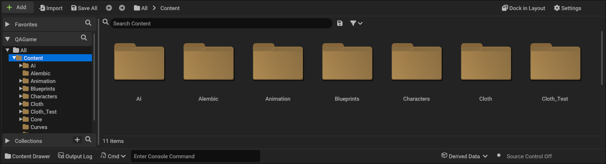
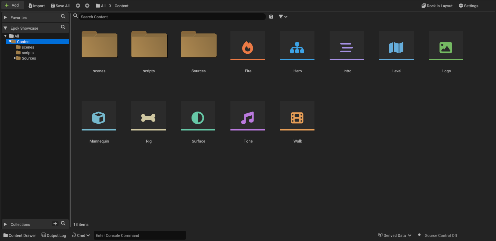
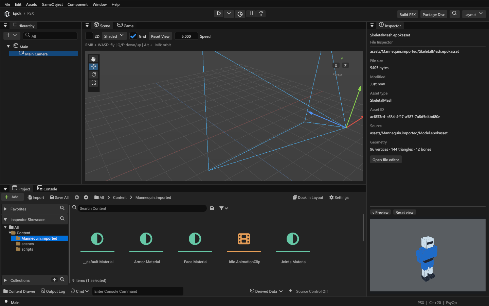
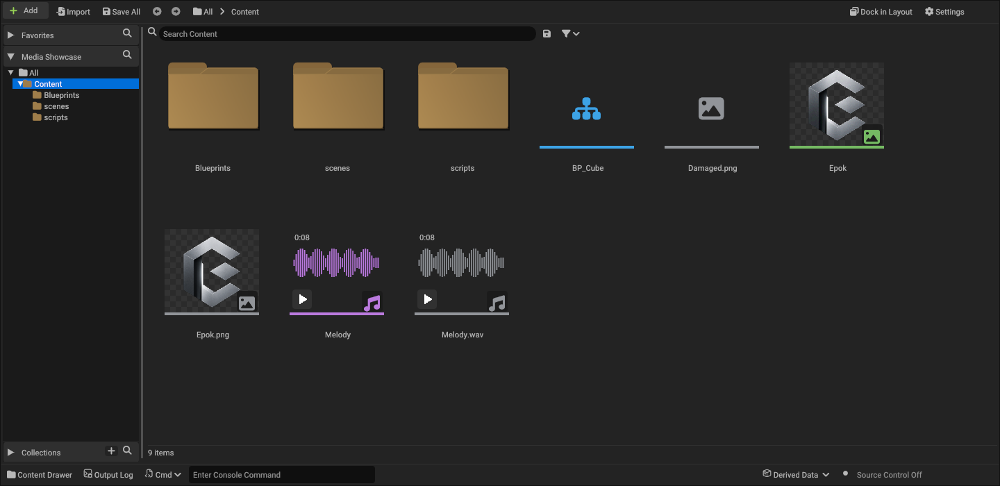
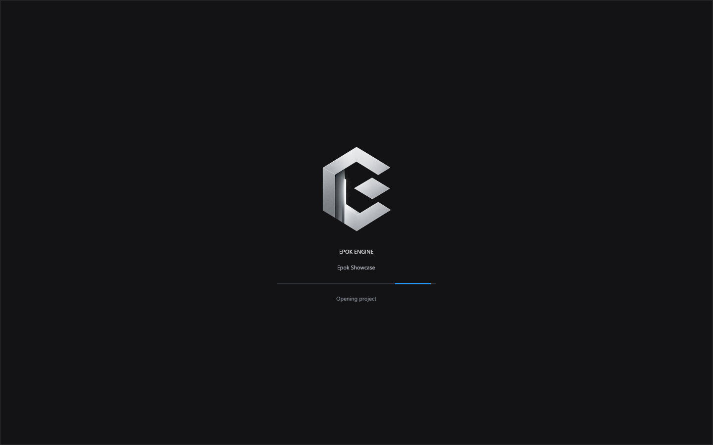

# Content Browser

The Project panel is a native ImGui Content Browser based on the supplied Unreal Engine screenshot. `Content` represents the project's `assets/` directory, including empty folders. No project files are renamed merely to display this label.



The toolbar contains Add, Import, Save All, Back/Forward, clickable breadcrumbs, Dock in Layout and Settings. The left side shows Favorites, the project folder tree and Collections, each with search controls. Drag the divider to resize the source panel. The right side shows gold folder tiles or a Name/Type/Path table, live search, an asset-type filter and the visible item count.

## Navigation and selection

- Double-click or Enter opens a folder or the asset's existing editor. Scene documents open in Scene from both tiles and list rows. If the current scene has unsaved edits, choose Save and Open, Discard and Open, or Cancel. Open Blueprints and Timelines keep their edits. A failed scene load leaves the current scene intact.
- Ctrl-click toggles selection; Shift-click selects a range; Ctrl+A selects visible results.
- Back/Forward and Alt+Left/Right navigate history; Backspace opens the parent folder.
- Search recursively finds names below the current folder. Filtering limits results by asset type. The disk button saves the current result set as a Collection.
- Settings controls tiles/list, thumbnail size, sorting and source visibility. Ctrl+wheel changes tile size; F5 refreshes content.
- Favorites are folder shortcuts. Collections store references to a set of paths. Drag items onto a Collection to add them without moving files.

Favorites, Collections and view settings are stored per project in `UserSettings/ContentBrowser.epokprefs`.

## Files and assets

Native assets use distinct, colored type icons in both tiles and list rows: Blueprint, Scene, Texture, Mesh, Skeleton, Audio, Animation, Material, Timeline and Particle Effect. Display names omit `.epokasset`, `.epokbp`, `.epokmap`, `.timeline.json` and `.particle-effect.json`. Full names remain available in tooltips and the list's Path column. Source files keep their extensions; presentation never changes the files on disk.



### Media previews

A single click selects a file or folder in the **Inspector**. The upper region shows its path, size, type and available metadata, including native asset ID, source, geometry counts, image dimensions or audio import settings. **Open file editor** opens its existing specialized editor. Selecting a scene object restores the component Inspector; merely inspecting a file never replaces the scene object or assigns a component.

The bottom **Preview** area stays visible while the details scroll. Drag its divider to change its height, resize the Inspector to change its width, or collapse it. PNG previews use up to 1024 pixels instead of the browser's 192-pixel thumbnails; use the wheel to zoom and **Reset view** to fit. Audio shows a larger waveform and shares Play/Stop with the browser. Native editable/skeletal meshes, model packages, raw FBX and OBJ have a separate GPU-rendered preview: drag to orbit, wheel to zoom, Reset view to frame. Skeleton and animation assets show their associated model's bind pose. These controls leave the project scene and its camera unchanged.





PNG images display aspect-correct thumbnails over a transparency checkerboard. Audio (WAV, MP3, FLAC and OGG) displays a waveform, duration, and an inline **Play / Stop** control; the progress line follows playback. List view also provides Play / Stop. Starting another audition stops the previous one; closing the project stops playback. Preview clicks do not open Imports or assign an asset to the selected object.

The type icon moves to the lower-right corner when a preview is available. Unsupported or damaged media keeps its large type icon; hover it for the preview error. Original media/model files use gray type icons, while imported Epok assets retain their type colors. **Settings > Hide unprocessed files** is enabled by default and saved per project. Turn it off to compare originals with imported assets. It hides importable PNG/audio/FBX/OBJ sources, including search and Collection results; C++ scripts remain visible.

Imported previews read the embedded `.epokasset` snapshot, so they still work without the original source. Texture previews show Epok's palette conversion. Audio auditions apply saved trim, channels, sample rate and normalization before PSX compression; they do not emulate SPU/XA compression artifacts or loop indefinitely. Host audio playback currently uses the default Windows output device.

Decoding runs off the UI thread and only visible media requests previews. A bounded cache holds up to 96 thumbnails/waveforms, refreshes changed files and reimports, and releases GPU textures when evicted or when the project closes. Raw PNG previews accept up to 16 megapixels within the decoder's 64 MiB limit; native imported textures keep the engine's import limits. Failed previews do not prevent normal asset operations.

Drag selected files or folders onto another folder in the tree, grid or breadcrumbs. The drop menu offers **Move Here** and **Copy Here**. Moves preserve file contents and asset UUIDs, preflight the entire selection, and reject overwrites, self-nesting and paths outside the project. Ctrl+Z reverses the last move in the current session. Favorites and Collections follow moved paths.

The context menu supports New Folder, Rename (F2), Duplicate, Delete, Copy Path and Show in Explorer. Ctrl+Shift+N creates a folder. Delete moves content into `UserSettings/ContentTrash`; each batch includes `restore.json` with its original paths. **Restore last deleted content** restores the current session's last batch without overwriting existing files. Saved references to deleted assets become missing until restored or replaced.

Copying supported imported packages generates fresh UUIDs. Timelines and particle effects receive independent asset identities. C++/Blueprint classes and composite FBX model packages use their existing class-creation or reimport workflows; direct file copying is rejected to avoid duplicate class identities or broken model ownership. The active scene and documents open in their editors cannot be moved or deleted. File extensions are preserved on rename.

**Import** accepts PNG, WAV, MP3, FLAC, OGG and FBX from the native Windows picker or an explicit path. Dropping those source files from the OS onto the Project panel also copies them into the current folder, then opens Imports for conversion settings. Existing files are never overwritten. Directory imports are not yet supported.

Drag supported content from Project into Scene to place meshes, audio, Blueprints, timelines or particle effects. Dropping a texture applies it to the selected mesh. Imported sources must be converted before placement. Placement uses existing Epok components and validation, at the Scene view center. Unsupported assets report an error without changing Scene.

To assign a Blueprint behaviour to an existing object, select the object in Scene or Hierarchy and drop one `.epokbp` anywhere in the Inspector body. This replaces its script binding while preserving the object's transform, geometry and other components; it does not place the Blueprint's entity template. Edit > Undo Component restores the previous binding and overrides. Re-dropping the same Blueprint preserves its instance values. Save an edited Blueprint before assigning it; abstract classes, compilation errors, multiple assets and assignment during Play report an error in Project without changing the scene.

When Auto Build is enabled, changing the assigned behaviour schedules a build. Console shows dependency checks, SDK/game compilation, verification and completion, while compiler errors and warnings remain visible. Full native command output is written to the project's `.epok/Build.log` for the latest build. The initial SDK build can take longer than later builds; the toolbar Stop button cancels an active build.

## Editor integration

Opening a project selects Project once, including when its saved layout had Console selected. Subsequent tab choices work normally. Project opening from the Hub or `--project` displays the embedded Epok logo and an animated activity indicator while a worker opens the project, loads its startup scene, discovers scripts and indexes assets. Loading errors return to the Hub with the error visible. There is no artificial delay or simulated percentage.

Startup establishes the source-observation baseline after loading and migration. Outdated cached build inputs are marked stale without launching an automatic build. Edits made after opening still use the configured auto-build behavior; Build and Play remain explicit ways to compile existing content.



Content Drawer switches to the bottom drawer; Dock in Layout returns to the previous docking node. Output Log focuses Console. Cmd exposes `save`, `build`, `play`, `stop` and `refresh`. Derived Data opens the asset dependency view. Source Control Off reflects the absence of an integrated source-control provider.

Add retains Epok's C++ Class, Blueprint Class, Timeline, Particle Effect and Timeline Adapter workflows. Those specialized workflows retain their established destination rules. This panel does not introduce Unreal-specific asset types, source-control integration or Unreal's complete advanced search language.

## Visual verification

`--screenshot-content-browser` displays the actual Project implementation on its own for reproducible captures. In this mode `--window-size` accepts sizes down to 640x300; normal editor minimums remain 1024x720. For example:

```text
epok-editor --project <fixture> --window-size 1258x342 --screenshot-content-browser --screenshot <output.png>
```

The design reference remains the supplied screenshot. Behavioral details were checked against Epic's [Content Browser interface documentation](https://dev.epicgames.com/documentation/en-us/unreal-engine/content-browser-interface-in-unreal-engine) and the authorized GitHub source files `ContentBrowserStyle.cpp`, `SContentBrowser.cpp`, `SAssetView.cpp` and `DragDropHandler.cpp`. The implementation uses Epok's existing Roboto, Font Awesome and Codicons resources with native folder geometry; no Epic source or artwork is bundled.

`tests/integration/create_content_browser_visual_fixture.py` creates a fresh temporary QAGame fixture with the reference folder names and can capture it with `--screenshot <output.png>`. See [verification notes](content-browser-qa.md).

`tests/integration/create_project_startup_visual_fixture.py` creates real native assets through the editor's creation/import commands and captures tile icons, list icons, startup focus and the splash. Pass `--editor target/debug/epok-editor.exe` to check the local development build used by the desktop shortcut. `--screenshot-loading --screenshot <output.png>` captures the first real splash frame without adding a delay to normal startup.

`tests/integration/create_content_preview_visual_fixture.py` imports real texture/audio packages and captures default visibility, original/processed pairs, list playback controls and compact thumbnails. Its malformed PNG verifies the large-icon fallback. Captures use an isolated recent-projects profile.

`tests/integration/create_asset_inspector_visual_fixture.py` captures the real Inspector with native models, original FBX, textures and audio. `--inspect-asset assets/path.epokasset` selects a file when opening a project, including screenshot runs.
