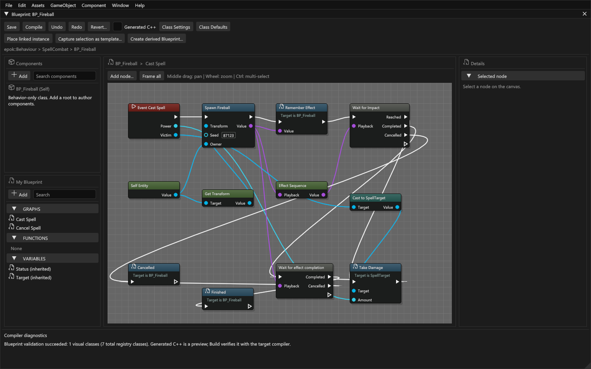

# Connect a spell to Blueprint gameplay

Use an effect's `Impact` marker to apply damage once, then wait for its particles
to finish. This tutorial follows the included `timeline-spell` project. Read
[Your first Blueprint](blueprints-tutorial.md) and [Using the VFX editor](vfx-editor.md)
if the editors are new to you.

## Run the example

Open `examples/timeline-spell/Timeline Spell.epokproject` and Play its startup
scene, `Combat.epokmap`. The first spell casts automatically. The target starts
at 100 HP and each Impact deals 25 damage.

| PSX control | Result |
| --- | --- |
| Cross | Cast again after the previous spell completes |
| Circle | Cancel the current effect |
| Square | Reload the combat scene |
| Start | Pause or resume |

Use your configured controller bindings in Game view. Cancelling before Impact
leaves HP unchanged. See the [example README](../examples/timeline-spell/README.md)
for its files and command-line launch options.

## Inspect the three parts

| File | Responsibility |
| --- | --- |
| `assets/Effects/Fireball.particle-effect.json` | Seven visual layers and the embedded Cast, Launch, Impact and Aftermath timeline markers |
| `assets/blueprints/BP_Fireball.epokbp` | Cast and cancellation graphs, captured target, marker wait and completion |
| `assets/scripts/SpellCombat.hpp` and `.cpp` | Reflected gameplay contract, input, target damage and HUD updates |

The graph determines when gameplay happens. The effect determines how the spell
looks and when its named moments occur. The effect does not inspect arbitrary
C++ memory or apply damage simply because particles overlap an object.

## Follow the cast graph

Open `BP_Fireball.epokbp`. Follow the execution wires in this order:

1. The cast event receives damage and a typed target. These values belong to
   this invocation and remain captured across its waits.
2. **Effect / Spawn asset** selects Fireball and creates a playback instance.
   Its Transform is in world space, zero seed uses the asset seed, and the owner
   controls activation and lifetime. Save the returned **EffectHandle** so the
   cancellation graph can stop this exact play.
3. **Effect / Sequence handle** gets the embedded sequence's **SequenceHandle**.
   Effect and sequence handles are different types; do not interchange them.
4. **Wait for marker** selects Fireball's embedded timeline and its `Impact`
   marker. Connect the sequence handle to the wait.
5. The **Reached** branch invokes damage on the captured target through a typed
   gameplay call. Keep damage on this branch, rather than on the wait's common
   **Next** output.
6. **Wait for effect completion** waits for the effect's bounded particle tail.
   Its successful outcome lets the spell report completion and become ready again.

The waits yield through the existing bounded continuation mechanism. They never
spin or block a frame. Even an already available result resumes on a later tick.
The original target stays captured: editing a field for the next cast cannot
redirect a suspended Impact to another entity.

## Handle every outcome

| Operation | Outcome | What your graph should do |
| --- | --- | --- |
| Wait for marker | Reached | Perform the gameplay tied to that crossing |
| Wait for marker | Completed | Handle playback that finished without satisfying the wait; do not apply hit damage |
| A playback wait | Cancelled | Release gameplay state or report cancellation when playback is stopped, unavailable or incompatible |
| Wait for sequence completion | Completed | Continue after timeline completion; particles may still be draining |
| Wait for effect completion | Completed | Continue after timeline completion and particle cleanup |

**Next** runs after the selected outcome branch. Do not put successful-hit logic
there unless it is also intended for completion-without-hit and cancellation.
If the consuming behaviour is destroyed or the scene is replaced, its continuation
is cancelled without running an outcome branch on that destroyed consumer.

The cancellation graph stops the stored EffectHandle. Stopping before Impact
prevents its damage branch; stopping after Impact does not undo damage already
applied. Retrying a cast event replaces its pending continuation, but does not
automatically stop an earlier directly spawned effect. Stop or otherwise own
that earlier play explicitly before replacing it.

## Bind your own scene targets

Direct asset nodes choose a source asset in the editor. Their external binding
pins come from that asset's typed slots. Connect required pins to compatible
EntityRefs; required null bindings fail compilation. Use an existing checked cast
when a general entity reference needs a more specific class.

Slot names are labels; their persistent identities preserve connections through
renaming or reordering. Removing a slot or changing its type can leave a stale
connection that you must repair. Internal effect-layer slots are managed by the
effect pool and are not scene entities.

**Get Transform** reads local placement. It can directly supply a root entity's
world placement; a child with transformed parents needs a correctly composed
world Transform. **Make Transform** provides an explicit transform. A spawned
effect keeps its supplied placement; a component effect follows its anchor.
Use component Play for an attached aura, and Spawn asset for an independent burst.

## Repeated markers and sustained effects

Use **Subscribe to marker** when a looping aura must respond to future crossings.
Its Next output continues immediately, while the captured listener branch runs
on subsequent crossings and re-arms. It does not replay crossings before
registration. Return ends that listener; stopping the playback cancels its producer.

Keep the listener small. Its branch may yield, but it shares the existing eight
latent slots with other suspended work. For a single projectile impact, **Wait
for marker** is simpler and avoids a persistent subscription. See [Timeline
reference](timelines.md) for backlog and cancellation details.

## Modify and verify

1. Move the existing `Impact` marker later in the effect editor. Retain its
   identity and place it inside the effect duration. Save and compile again.
2. Play: damage should occur at the new marker time, not at a hardcoded Delay.
3. Cancel before Impact: HP must remain unchanged. Cast again and let it finish:
   HP must drop once and the effect must clean up.
4. Pause during the cast, then resume. There must be no duplicated hit.
5. Reload the scene during the cast. The old continuation must not damage the
   new scene's target, even if it occupies a reused runtime slot.
6. Test multiple effects with native counters before increasing layer or particle
   counts. Then rebuild the standalone export from its generated build script.

If the graph cannot find the marker, check the selected embedded timeline and
marker identity instead of creating a second marker with the same label. If a
build is stale, repair current sources and rebuild; do not use an old executable
as evidence for your edited graph. [Troubleshooting](blueprints-vfx-troubleshooting.md)
collects the common recovery steps.
