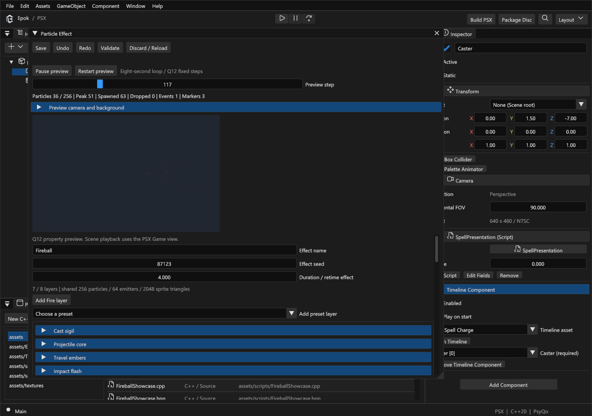

# Using the VFX editor

Create reusable effects from sprite and particle layers, animate them over time,
and place them in a scene. Each `.particle-effect.json` asset contains one
embedded TimelineAsset. The same timeline system also drives scene sequences.

Start here for visual authoring. Continue with [the spell tutorial](spell-tutorial.md)
to trigger the effect from Blueprints, or [Timeline reference](timelines.md) for
typed scene bindings and runtime rules. Authoring uses the Windows reflection
toolchain described in [Getting started](getting-started.md).

## Open a working effect

Open `examples/timeline-spell/Timeline Spell.epokproject` from the engine checkout.
In Project, double-click `assets/Effects/Fireball.particle-effect.json`. This
example already has an imported atlas, seven layers, curves, bursts and markers.
It is useful for learning the controls before building an effect from scratch.

Use **Pause preview**, **Restart preview**, and **Preview step** to inspect the
effect. The preview uses the authored seed, so restarting a fixed seed gives a
repeatable simulation. Orbit with the camera controls and change the background
to check the silhouette. The transport and counters remain visible while the
layer and timeline controls scroll.

The preview uses the production C++ timeline/effect/particle simulation with the
host sprite renderer. Neutral lighting helps inspect an isolated asset. It is
not a pixel-identical PSX render, and it does not run your native gameplay.

## Create an effect from scratch

1. Import a suitable texture or atlas using [Textures](textures.md). A transparent
   spark, smoke puff or rune makes a better starting point than a full scene image.
2. In Project, choose **New Particle Effect**, name it, and open the source asset.
3. Expand a layer. Use **Add preset layer** for Fire, Smoke, Sparks, Impact,
   Projectile, Aura or Rune. **Add Fire layer** is a shortcut. Presets add normal
   editable settings and tracks; they do not introduce a separate effect format.
4. Open **Advanced sprite and emission** and select the imported Texture. Set its
   pixel atlas rectangle, world size and blend mode. Repeat for layers that use
   another part of the atlas.
5. Adjust the layer controls, restart the preview and check the counters.
6. Choose **Validate**, resolve the reported errors, then **Save**.

A missing texture or wrong atlas rectangle can make a valid simulation invisible.
Start with one visible layer and add complexity after that layer works.

## Choose the right layer

| Layer | Use it for | What to edit |
| --- | --- | --- |
| Sprite | A flash, core, rune or persistent glow | Texture, size, color, opacity tracks, local offset and optional flipbook |
| Emitter | Sparks, smoke, embers or trails made of many particles | Rate/burst, lifetime, initial velocity, spread, gravity, size/color over particle life |

Clear **Layer enabled** to disable that layer. **Local offset** places it relative to the
effect. Rename layers by purpose, such as `Impact flash` or `Aftermath smoke`.
Move up/down changes authoring order; it does not fix PSX depth sorting or change
the layer's identity. **Remove layer and its tracks** also removes its internal
slot and target tracks. Undo restores the layer and those connections together.

### Artistic controls

| Control | Effect on the authored data |
| --- | --- |
| Density | Adjusts emission or existing burst counts for emitter layers |
| Violence / speed | Adjusts how quickly particles move |
| Scale | Adjusts sprite or particle size |
| Brightness | Adjusts color intensity |
| Chaos / spread | Widens the particle velocity spread |
| Direction | Changes the emission direction |

These controls edit the same fields exposed under **Advanced sprite and emission**.
Inspect the advanced values when a broad adjustment is not precise enough.
Increasing density does not increase the runtime's capacity.

### Texture and particle settings

The atlas rectangle is in pixels; world size is in scene units. A `[0,0,0,0]`
rectangle selects the whole texture. Check **Flipbook frames**, **Flipbook columns**
and **Seconds per cell** for sprite animation; every selected cell must fit the atlas.

Spherical billboards face camera yaw and pitch. Upright keeps world up while
following camera yaw. Fixed inherits the full transform. Cutout uses transparent
palette pixels; Add is useful for bright flashes, while smoke commonly needs a
less luminous blend. The texture's own colors multiply with the tint: a warm
orange atlas will not become a neutral blue image just by increasing blue tint.

For an emitter, continuous rate produces particles over time; a timeline burst
creates a discrete group. Lifetime controls how long each particle survives.
Local-space particles follow the emitter's transform; world-space particles keep
their emitted placement when it moves. Velocity, spread and gravity determine
motion; start/end size and color describe each particle's life.

Sprites share PSX depth ordering with geometry. A modest negative depth bias can
bring a hit flash in front of an enemy billboard. A large bias may make it draw
through unrelated scenery. Preview the actual camera in Game view before shipping.

## Animate the embedded timeline

The **Embedded Timeline** section contains slots, property tracks, event tracks
and markers. Internal layer slots are created with their layers; remove them
through the layer controls. Add external entity slots only when the effect needs
to control a typed scene object.

1. On a layer slot, use **Add property track** and choose an exposed property,
   such as opacity, size or position.
2. Expand the track and edit its keys. A curve has at most four keys, with
   distinct increasing ticks inside the duration.
3. Choose interpolation and, where supported, Absolute or Additive blending.
   Use **Restore initial value** when the target should recover its captured
   value after playback instead of retaining the final value.
4. Use **Add event track** to select an exposed action such as Burst. Set its
   event key time and typed arguments. A marker by itself does not emit particles.
5. Add markers for named moments that gameplay can observe: `Cast`, `Impact`,
   `Aftermath`. Keep their existing identities when renaming or moving them.
6. Validate and restart the preview to inspect the combined effect.

Times in key fields are raw Q12 ticks: **4096 ticks = 1 second**. Preview step is
a simulation-step index, not a key tick. The default step advances 68 raw ticks.

For a one-second flash, an opacity curve can use:

| Tick | Seconds | Opacity |
| ---: | ---: | ---: |
| 0 | 0 | 0 |
| 410 | about 0.10 | 1 |
| 2048 | 0.50 | 0.5 |
| 4096 | 1.00 | 0 |

Linear moves at a constant rate between keys. Step holds a value until the next
key. Smoothstep, EaseIn and EaseOut shape supported numeric curves. Curves hold
their endpoints outside the key interval. Two same-priority Absolute tracks on
the same property therefore conflict even if their keys appear far apart.

**Duration / retime effect** rescales existing keys and markers. It rejects a
change that would merge distinct curve keys. The embedded **Duration (seconds)**
field changes the duration directly; use the retime control when you want the
whole effect to stretch. **Repeat** changes playback looping; the preview's
eight-second transport loop is a separate viewing aid.

## Put the effect in a scene

1. Create or select an entity for the effect's anchor and position it in the scene.
2. Add **Particle Effect Component** in the Inspector.
3. Select the effect asset, leave it enabled, and enable **Play on start** for an
   automatic effect. Keep it off when gameplay will trigger the component.
4. Assign every required external slot to an entity of the requested class.
   Internal layer slots are supplied by the effect itself.
5. Choose a seed override if needed; zero uses the asset seed.
6. Save the scene and Play. Inspect the effect under the actual camera and lighting.

The component follows its entity's world transform. **Open Particle Effect**
returns to the reusable asset. Per-layer component overrides affect that instance;
the asset preview shows asset defaults. Timeline tracks take precedence once
they animate an overridden property.

For transient explosions or projectiles, use Blueprint **Effect / Spawn asset**
instead. It accepts a world Transform and optional owner and does not require a
persistent effect component. Follow [Spell tutorial](spell-tutorial.md) for the
handle, marker and completion wiring.

## Validate appearance and cost

Check the preview's alive/peak particles, dropped work, events and markers.
Test the intended number of simultaneous effects with geometry and HUD in Play.
The shared limits are eight effect instances, eight director instances, eight
layers per effect, 64 emitter sources, 128 particles per emitter, 256 global
particles and 2048 sprite triangles per frame. Scene emitters share these pools.
These limits bound storage; they do not promise a particular frame rate.

Normal completion hides sprite layers and lets particles drain for a bounded
lifetime. Explicit Stop removes them immediately. Paused or inactive owners
freeze playback; inactive owners also hide their effects. Destroying the owner
or replacing the scene cancels its effects. See [Performance](performance.md)
and [troubleshooting](blueprints-vfx-troubleshooting.md) when counters rise.

## Save and recover safely

Effects and their timelines share Undo/Redo and one Save operation. Validate
checks the draft; Save persists it. External edits block a conflicting save.
Use **Discard / Reload** only when you intend to discard your current draft.

Changing assets refreshes the preview from the seed. Changing native classes,
reflection or graph code requires rebuilding and restarting Play. A previous
valid preview can be retained as explicitly stale data; it is not proof that
the current source will build. Repair the displayed error before exporting.
